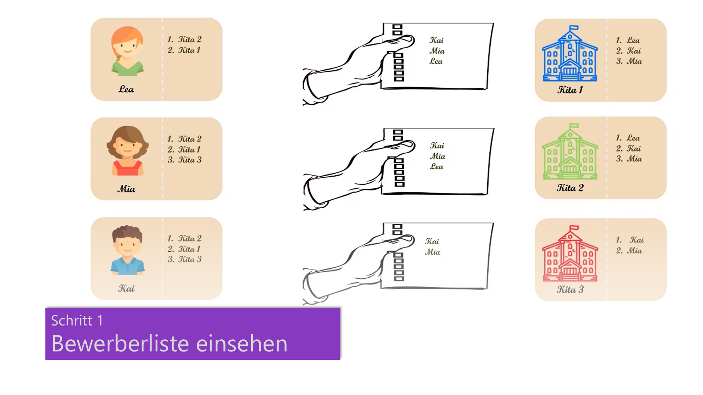
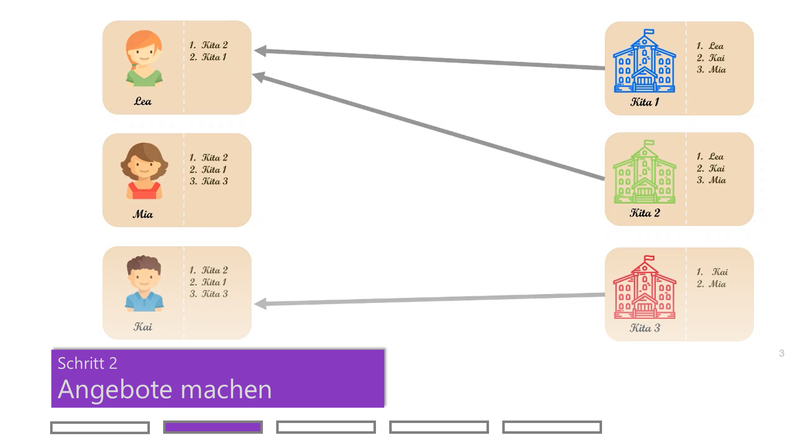
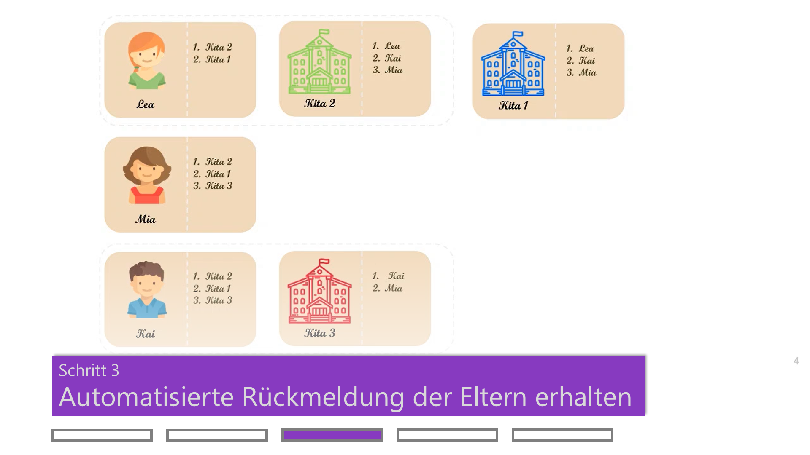
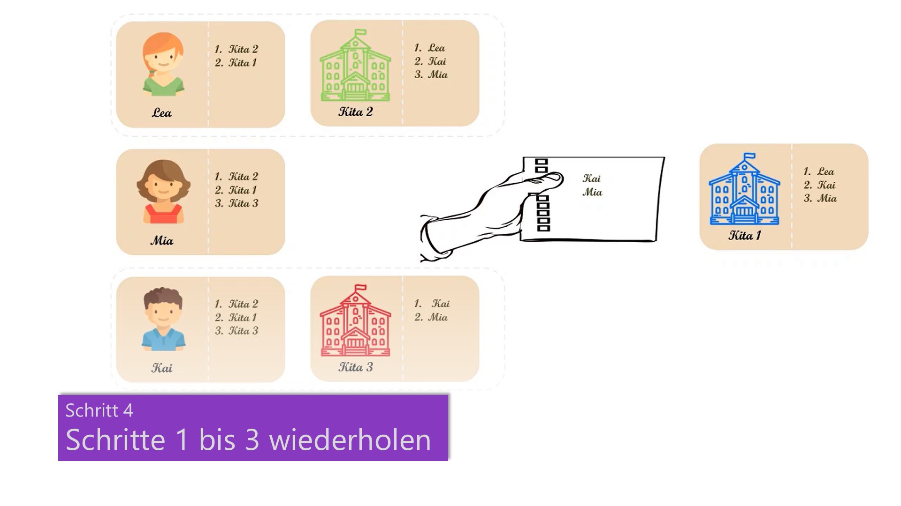

# Fallbeispiel: Erfahrung im Landkreis Steinfurt
{: .no_toc }

Der Prozess der Kitaplatzvergabe und das verwendete Gale-Shapley Verfahren lassen sich am besten über ein Fallbeispiel erklären.
{: .fs-6 .fw-300 }

## Inhalt
{: .no_toc .text-delta }

1. TOC
{:toc}

---

## Kurzüberblick
{: .no_toc }

### Warum der Status Quo ein Problem darstellt

Im Folgenden erklären wir das neue Verfahren, das im Kreis Steinfurt umgesetzt wird, und dort eine schnelle, faire und transparente Platzvergabe möglich macht. In den in vielen Städten verwendeten Verfahren verschicken Kitas ihre Angebote unabhängig und weitgehend unkoordiniert. Probleme entstehen, wenn sich Eltern beispielsweise dazu entscheiden, ein frühes, unattraktives Angebot um der Sicherheit willen anzunehmen. Auch treten Probleme auf, wenn Eltern in Erwartung eines besseren Angebots vorübergehend mehrere Plätze halten und diese damit für andere Familien blockieren. Der erste Aspekt führt zu einer unfairen Verteilung, in der es Bewerber gibt, die „berechtigten Neid“ auf andere Bewerber haben. Etwa weil ein Kind keinen Platz in der Kita seiner Geschwister bekommt, obwohl es dort aufgrund des Geschwisterstatus Vorrang hätte. Der zweite Aspekt verlangsamt das Aufnahmeverfahren und führt zu Planungsunsicherheiten auf Seiten der Eltern und Arbeitgeber.

### Woran bisherige Lösungsansätze scheiterten

Eine mögliche Lösung des Problems wäre die Einführung einer zentralen Koordinierungsstelle. Eine solche Koordinierungsstelle ist zum Beispiel die Plattform “Hochschulstart” bei der Studienplatzvergabe, die Ranglisten der Bewerber/innen und Hochschulen erhebt und damit eine gut durchdachte Platzvergabe gewährleistet. Kitas sind aber oft nicht in der Lage, vollständige Ranglisten über Bewerber an eine zentrale Stelle zu übermitteln. Eine wichtige Rolle spielt die Berücksichtigung sogenannter Komplementaritäten, wie zum Beispiel der gewünschten Geschlechter- und Altersmischung in den Betreuungsgruppen auf Seiten der Kitas oder Aufnahme von Geschwisterkindern in der gleichen Einrichtung auf Seiten der Eltern. Solche Komplementaritäten lassen sich nicht so einfach über Ranglisten ausdrücken.

<!--image slider start-->

  

    <!--radio buttons start-->
    <input type="radio" name="radio-btn" id="radio1">
    <input type="radio" name="radio-btn" id="radio2">
    <input type="radio" name="radio-btn" id="radio3">
    <input type="radio" name="radio-btn" id="radio4">
    <input type="radio" name="radio-btn" id="radio5">
    <!--radio buttons end-->
    <!--slide images start-->
    

      
    

    

      
    

    

      
    

    

      
    

    

      
    

    <!--slide images end-->
    <!--automatic navigation start-->
    

      

      

      

      

      

    

    <!--automatic navigation end-->
  <!--manual navigation start-->
  

    <label for="radio1" class="manual-btn"></label>
    <label for="radio2" class="manual-btn"></label>
    <label for="radio3" class="manual-btn"></label>
    <label for="radio4" class="manual-btn"></label>
    <label for="radio5" class="manual-btn"></label>
  

  

  <!--manual navigation end-->

<!--image slider end-->

### Die Vorteile der neuen Lösung

Der in der Softwareanwendung „KitaMatch“ implementierte Mechanismus ermöglicht es den Kitas dagegen weiterhin dezentralisierte Angebotsentscheidungen zu treffen. In dem iterativen Verfahren bekommen die Kita-Leitungen in jeder Runde die noch interessierten Bewerber auf einer Softwareplattform angezeigt und registrieren ihre Platzangebote. Damit werden Komplementaritäten berücksichtigt, da Kitas ihre Angebote von Platzzusagen aus vorhergehenden Runden abhängig machen können. Gleichzeitig wird eine schnelle und faire Zuordnung erzielt, indem die Plattform die Entscheidungen der Eltern automatisiert und in jeder Runde jeweils nur das beste Angebot für sie hält. Alle anderen Angebote werden direkt abgelehnt. Der Mechanismus verbindet damit die Vorzüge einer zentralen Vergabe mit denen der dezentralen Vergabe.

Mit Blick auf die Geschwindigkeit zeigt eine aktuelle Studie (Reischmann/Klein/Giegerich 2021), dass sich die Kitaplätze mit dem Verfahren in etwa einer Stunde mit rund sechs bis zehn Runden vergeben lassen – in Großstädten genauso schnell wie in kleineren Kommunen. Das lässt sich mit den Präferenzen der Eltern für nahegelegene Kitas erklären. Auch Großstädte bestehen somit aus vielen lokal begrenzten Kita-Märkten. Bezüglich der Fairness zeichnet die Studie ein differenziertes Bild: In den Pilotkommunen reduziert das neue Verfahren die Anzahl der Bewerber mit berechtigtem Neid lediglich um die Hälfte, verglichen mit dem zuvor verwendeten Verfahren. Das ist der Preis der Träger- und Kita-Autonomie. Mit einem zentralen Verfahren ließe sich berechtigter Neid zwar vollständig vermeiden. Die Entscheidungsfreiheit der Kitas würde damit aber so stark eingeschränkt, dass es für 20 Prozent der Kitas nicht attraktiv wäre, freiwillig an dem zentralen Verfahren teilzunehmen.

---

## Unterkapitel
{: .no_toc }

- [Perspektive des Jugendamtes](/docs/Fallbeispiel/Perspektive-des-Jugendamtes)

