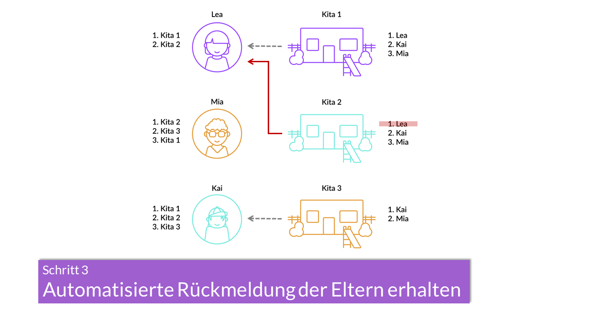

# Der Mechanismus hinter KitaMatch
{: .no_toc }

In diesem Kapitel stellen wir das von David Gale und Lloyd Shapley (1962) entwickelte Zuteilungsverfahren (Mechanismus) vor, welches der Kitaplatzvergabe respektive der Software KitaMatch zugrunde liegt. Wir beschreiben, wie mit diesem Verfahren eine Zuteilung von Kindern auf die verfügbaren Kitaplätze basierend auf dem Kriterienkatalog bzw. den Prioritäten der Kitas und den Präferenzen der Eltern ermittelt wird. 

<!-- Slider main container -->

  <!-- Additional required wrapper -->
  

    <!-- Slides -->
    

    

    

    

    

  <!-- If we need pagination -->
  

  <!-- If we need navigation buttons -->
  

  

In [Kapitel 2.1](/docs/Gale-Shapley-Verfahren/Stabilität-und-Strategie-Sicherheit) werden wichtige Begriffe eingeführt, insbesondere "Stabilität" und "Strategiesicherheit" definiert. Anschließend wird im [Kapitel 2.2](/docs/Gale-Shapley-Verfahren/Gale-Shapley-Verfahren) das  Gale-Shapley-Verfahren beschrieben. Dabei wird insbesondere auf die semidezentrale Variante dieses Verfahrens, welche der Software KitaMatch zugrunde liegt, eingegangen.     
Für das praktische Verständnis wird im [Kapitel 2.3](/docs/Gale-Shapley-Verfahren/Gale-Shapley-Beispiel) das Gale-Shapley-Verfahren anhand eines Beispiels beschrieben und mit zwei herkömmlichen Zuteilungsverfahren([First-Preference-First-Mechanismus](/docs/Gale-Shapley-Verfahren/First-Preference-First-Mechanismus), [Unkoordiniertes Verfahren](/docs/Gale-Shapley-Verfahren/Unkoordiniertes-Verfahren)) verglichen: dem First-Preference-First-Mechanismus und der unkoordinierten Vergabe.    
Abschließend werden im [Kapitel 2.4](/docs/Gale-Shapley-Verfahren/Grenzen-des-Gale-Shapley-Verfahrens) potenzielle Grenzen des Vergabeverfahrens in der Kitaplatzvergabe diskutiert.   

---

## Inhalt
{: .no_toc .text-delta }

1. [Stabilität und Strategiesicherheit](/docs/Gale-Shapley-Verfahren/Stabilität-und-Strategie-Sicherheit)
2. [Gale-Shapley-Verfahren](/docs/Gale-Shapley-Verfahren/Gale-Shapley-Verfahren)
3. [Beispiel: First-Preference-First Mechanismus](/docs/Gale-Shapley-Verfahren/First-Preference-First-Mechanismus) 
   [Beispiel: Unkoordiniertes Verfahren](/docs/Gale-Shapley-Verfahren/Unkoordiniertes-Verfahren) 
   [Beispiel: Gale-Shapley Verfahren](/docs/Gale-Shapley-Verfahren/Gale-Shapley-Beispiel)
4. [Grenzen des Gale-Shapley-Verfahrens](/docs/Gale-Shapley-Verfahren/Grenzen-des-Gale-Shapley-Verfahrens)

