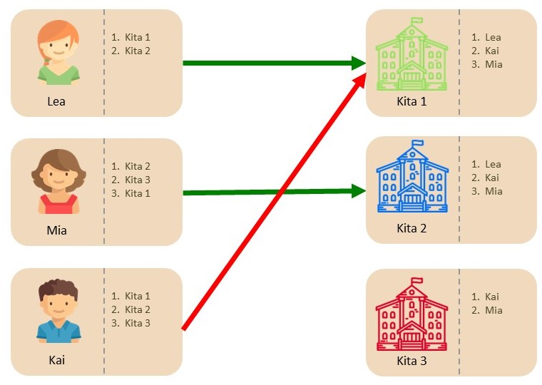
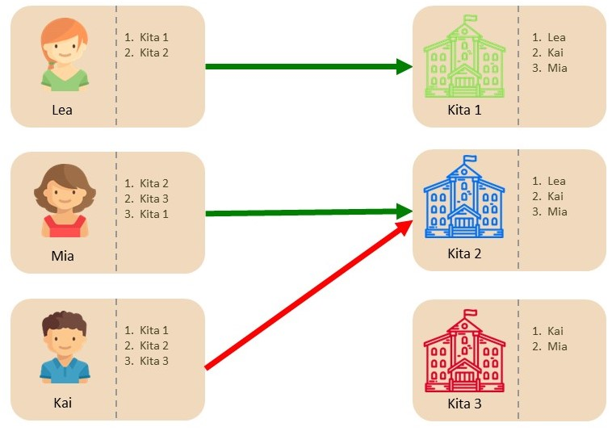
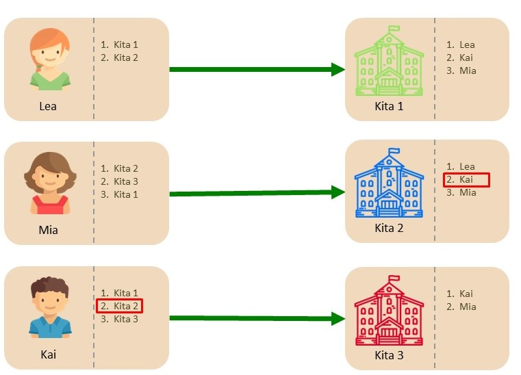

# Beispiel: First-Preference-First Mechanismus

Im Folgenden wird das exakt selbe Beispiel benutzt, um die Funktionsweise drei verschiedener Zuteilungsmethoden([First-Preference-First-Mechanismus](), [unkoordiniertes Verfahren](/docs/Gale-Shapley-Verfahren/Unkoordiniertes-Verfahren) und [Gale-Shapley-Verfahren](/docs/Gale-Shapley-Verfahren/Gale-Shapley-Beispiel)) zu illustrieren und intuitiv aufzuzeigen, weshalb das Gale-Shapley-Verfahren als einziges Zuteilungsverfahren sowohl stabil als auch strategiesicher ist.

---

Beim First-Preference-First-Mechanismus machen Bewerber Angebote an die Kitas, welche direkt angenommen (oder abgelehnt) werden müssen - dies kann sowohl zu Instabilitäten führen als auch strategische Abwägungen erfordern:

**1.** In der ersten Runde machen Lea und Kai beide ein Angebot an Kita 1, da dies ihre „Wunschkita“ ist. Bei Kita 1 hat Lea eine höhere Priorität als Kai - da Kita 1 nur einen Platz zur Verfügung hat (wie alle Kitas), bekommt Lea eine Zusage (grüner Pfeil) und Kai eine Absage (roter Pfeil). Mia bewirbt sich bei Kita 2 und bekommt auch direkt eine Zusage (grüner Pfeil).

<small>Abbildung: First-Preference-First-Mechanismus - Schritt 1<small>

{:height="500px" width="500px"}

**2.** In der zweiten Runde macht Kai seiner Zweitwahl-Kita ein Angebot, welches abgelehnt wird, da bereits in der vorherigen Runde Mias Angebot direkt angenommen wurde. 

<small>Abbildung: First-Preference-First-Mechanismus - Schritt 2<small>
  
{:height="500px" width="500px"}

**3.** In der dritten Runde macht Kai noch der letzten Kita ein Angebot, welches direkt angenommen wird. 

<small>Abbildung: First-Preference-First-Mechanismus - Schritt 3<small>
  
{:height="500px" width="500px"}

{: .highlight}
> **Nicht Stabil**: Kai würde lieber einen Platz bei Kita 2 haben und hat eine höhere Priorität als Mia.
>
> **Nicht strategiesicher**: Anstatt zuerst bei Kita 1 ein Angebot zu machen, hätte Kai einen besseren Betreuungsplatz ergattert, wenn er sich direkt in Runde 1 bei Kita 2 beworben hätte. 

