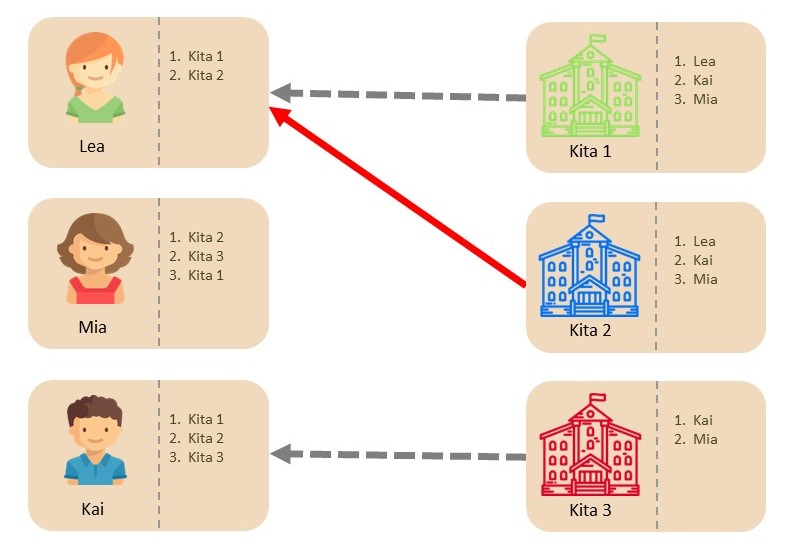
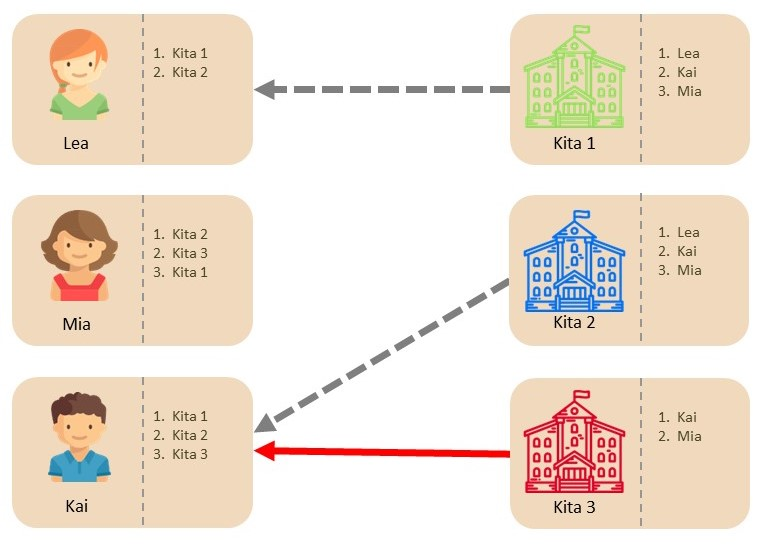
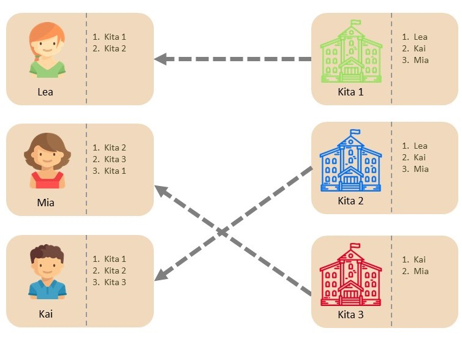
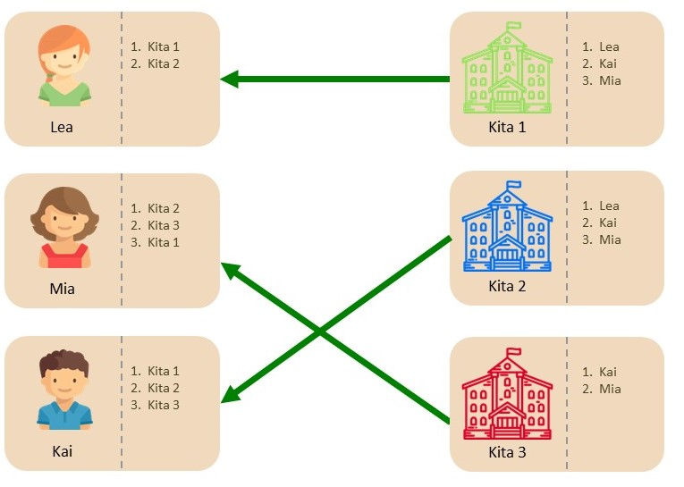

# Beispiel: Gale-Shapley Verfahren

Im Folgenden wird das exakt selbe Beispiel benutzt, um die Funktionsweise drei verschiedener Zuteilungsmethoden([First-Preference-First Mechanismus](), [unkoordiniertes Verfahren]() und [Gale-Shapley Verfahren]()) zu illustrieren, und intuitiv aufzuzeigen, weshalb das Gale-Shapley Verfahren als einziges Zuteilungsverfahren sowohl stabil als auch Strategie-Sicher ist.

---

Wie in den vorangegangenen  Beispielen dargestellt wurde, hängt die Problematik von Instabilität und Strategie-Sicherheit mit der direkten Annahme zusammen. Das Gale-Shapley Verfahren löst das Problem, indem er es Bewerbern erlaubt, das beste Angebot zu halten; sie aber nicht dazu zwingt, ein Angebot direkt anzunehmen: 

**1.** Kitas machen Angebote ihrer Priorität folgend. Lea bekommt ein Angebot von Kita 1 und Kita 2 und lehnt Kita 2 ab (roter Pfeil). Das  Angebot von Kita 1 hält sie (grauer Pfeil). Mia muss warten da ihr kein Angebot in dieser Runde unterbreitet wird, während Kai das Angebot von Kita 3 hält (grauer Pfeil) --- im Gegenteil zum „Unkoordinierten Verfahren“ muss sich Kai nicht entscheiden ob er das Angebot annimmt oder Ablehnt und kann keinen „strategischen Fehler“ machen.

<small>Abbildung: Gale-Shapley Verfahren - Schritt 1<small>
  
{:height="500px" width="500px"}

**2.** Kitas, deren Angebote gehalten werden, machen in dieser Runde jeweils keine neuen Angebote. Deshalb macht nur Kita 2 ein neues Angebot an Kai, welcher dieses hält und Kita 3 eine Absage erteilt. 

<small>Abbildung: Gale-Shapley Verfahren - Schritt 2<small>

{:height="500px" width="500px"}

**3.** Kitas deren Angebote gehalten werden, machen in dieser Runde jeweils keine neuen Angebote. Deshalb macht nur Kita 3 ein neues Angebot an Mia welche dies hält.

<small>Abbildung: Gale-Shapley Verfahren - Schritt 3<small>

{:height="500px" width="500px"}

**4.** Wenn keine Kita mehr ein neues Angebot machen kann, werden die gehaltenen Angebote angenommen und eine finale Zuteilung ist erreicht (grüne Pfeile). 

<small>Abbildung: Gale-Shapley Verfahren - Schritt 4<small>

{:height="500px" width="500px"}

  
<b>Stabil</b>: Wie auch im Beispiel ergibt das Gale-Shapley Verfahren immer eine stabile Zuteilung. 

  
<b>Strategie-Sicher</b>: Keiner der Bewerber kann jeweils einen präferierten Betreuungsplatz erhalten, wenn er eine oder mehrere Kitas in seiner Rangliste nach oben oder unten verschiebt.

