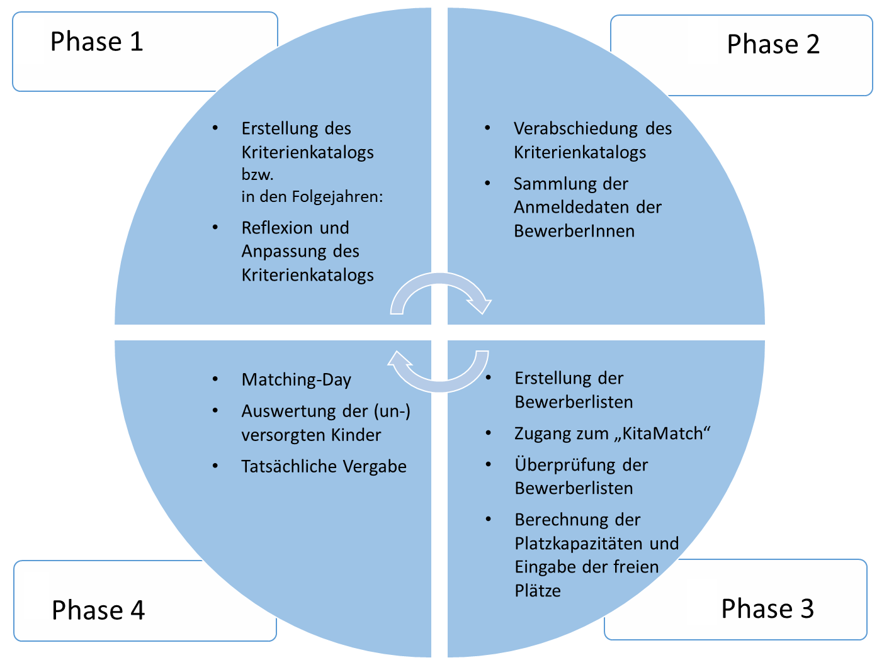

# Das Projektmanagement für die Platzvergabe
{: .no_toc }
Die Einführung des Matchingverfahrens ist grundsätzlich im Rahmen eines Projektmanagements umzusetzen. Im Folgenden werden in Anlehnung an die Umsetzung in der Pilotkommune Ideen und Vorschläge vorgestellt, die insbesondere für die Kommunen bzw. die Projektleitung hilfreich sind. 

## Inhalt
{: .no_toc .text-delta }

1. TOC
{:toc}

---

## Das 4-Phasenmodell

Die Zeitplanung ist einer der entscheidenden Faktoren für ein erfolgreiches Projekt. Im Folgenden wird ein möglicher Zeitplan anhand eines 4-Phasenmodells vorgesschlagen, das natürlich auf Ihre Rahmenbedingungen und Ressourcen angepasst werden kann. 

Sobald der erforderliche politische Beschluss und idealerweise das Einverständnis aller Beteiligten vorliegen, beginnt die Phase 1 mit der Erstellung eines (einheitlichen) Kriterienkatalogs. Anschließend wird in der Phase 2 der Kriterienkatalog von den zuständigen Gremien genehmigt  und die notwendigen Daten des angemeldeten Kindes bzw. dessen Eltern eingeholt. In der Phase 3 werden die Bewerberlisten zusammengestellt und im KitaMatch hochgeladen. Um sie dort prüfen zu können, erhalten die beteiligten Kitaleitungen bzw. Fachberatung der Kindertagespflege die von der Kommune erstellten Zugänge. Gleichzeitig berechnet das Jugendamt pro Einrichtung die freien Plätze in der jeweiligen Altersgruppe und hinterlegt diese Zahl im KitaMatch. Sobald der Matching-Day (Phase 4) stattgefunden hat, kann das Jugendamt eine Liste mit (un-)versorgten Kindern generieren, und die Kitaleitungen bzw. Fachberatung der Kindertagespflege können den Eltern tatsächlich eine Zu-  bzw. Absage erteilen. Somit schließt sich der Kreis, und die nächste Vergabephase beginnt mit der Reflexion bzw. möglichen Anpassung des bestehenden Kriterienkatalogs (Phase 1 usw.). 

<small>Abbildung: Das 4-Phasenmodell</small>

---

## Die Projektleitung und die Rolle des Jugendamtes

Eine Projektleitung ist für das Gelingen zwingend erforderlich. Sie sollte über die erforderlichen kommunikativen und projektorientierten Skills und Ressourcen verfügen, das Matchingverfahren und die Zusammenhänge verstehen und eng mit dem Jugendamt agieren. Sofern die Kommune eigene Kitas betreibt, sollte sich die Projektleitung dieser besonderen Stellung bewusst sein. Dies sollte bei der Besetzung/Auswahl der Projektleitung berücksichtigt werden. 

Das Jugendamt muss sich bereits im Vorfeld über Vor- und Nachteile des Matchingverfahrens bewusst sein – ebenso über den Aufwand, das neue Verfahren einzuführen, und über den Mehrwert, wenn sich das Verfahren verstetigt. Sicherlich sind mit der Einführung eines solchen neuen Verfahrens ein Risiko und eine gewisse Skepsis verbunden. Umso wichtiger sind folgende Erfolgsfaktoren und Aufgaben:

- Eine Reflexion des bisherigen Verfahrens ist der grundlegende, erste Schritt, um die IST-Situation zu beschreiben. Erst im Anschluss ist es sinnvoll, dass die Beteiligten Wünsche und Ziele eines neuen Verfahrens (das Gale Shapley Verfahren) formulieren.  
- Ein weiterer Meilenstein ist die Information und Legitimation durch die Politik, damit das neue Verfahren eingeführt werden kann. Darüber hinaus sollten die Vertretungen von Träger, Kitas, die Fachberatungen der Kindertagespflege, die Kindertagespflegepersonen sowie die Eltern informiert und sensibilisiert werden. 
- Neben einer klaren und transparenten Kommunikation unter den Beteiligten ist die Bereitschaft, etwas Neues zu wagen, ebenso wichtig. Dabei spielt lösungsorientiertes, gemeinschaftliches Handeln im Rahmen der Verantwortungsgemeinschaft, die die Beteiligten bilden, eine große Rolle.
- Sowohl die frühzeitige Information an die Verfahrensbeteiligten als auch eine intensive Presse- und Öffentlichkeitsarbeit tragen zum Gelingen des Projektes bei. Hierzu zählen insbesondere Informationsgespräche mit den politischen Vertretungen, Trägern/Kitaleitungen, Fachberatungen der Kindertagespflege, Kindertagespflegepersonen und ebenso Elternbriefe mit konkreten Hinweisen, intensive Pressearbeit. In diesem Zuge ist es sinnvoll, beispielsweise erfahrene Kitaleitungen als Ansprechpartner:Innen bzw. Multiplikatoren einzusetzen.  
- Für eine erfolgreiche Implementierung ist es ebenso wichtig, die Regelungen des Datenschutzes einzuhalten. Denn die notwendigen Daten zählen zu dem persönlichen und damit zu schützenden Datengut.
  Damit einher geht die Notwendigkeit, dass die erforderlichen Daten (z.B. Angaben der Eltern, Anzahl der freien Plätze) vollständig und wahrheitsgetreu sind. 
- Sowohl nach der Implementierung als auch im Rahmen der Verstetigung ist eine regelmäßige Reflexion mit den Beteiligten sinnvoll, sodass etwaige Optimierungen   umgesetzt werden können. 

Sofern ein entsprechender politischer Beschluss für die Einführung des Matchingverfahrens vorliegt, ist es wichtig, alle Beteiligten frühzeitig mit einzubinden. Dazu zählen insbesondere die Träger-, Kitavertretungen, Fachberatungen der Kitas und Kindertagespflege ebenso die Eltern.

Darüber hinaus ist eine offene Haltung des Jugendamtes bzw. der Projektleitung gegenüber den Beteiligten entscheidend. Fragen müssen geklärt, Bedenken und Zweifel ernst genommen sowie Gespräche geführt werden. Die Kommunikation ist dabei ein entscheidender Faktor für ein erfolgreiches Projekt – sowohl nach innen als auch nach außen. Demzufolge ist es empfehlenswert, dass die Beteiligten im Innenverhältnis im stetigen Austausch stehen und in der Lage sind, Fragen von „außen“, von Eltern und anderen Interessierten zu beantworten. Die Eltern sind daher frühzeitig über das Matchingverfahren zu informieren, z.B. mit einem Elternbrief/Pressemitteilungen.

Ein weiterer wichtiger Aspekt ist, dass die Beteiligten die Vorteile des Systems verstehen und das Matching für sich adaptieren möchten. Dabei ist es auch von Vorteil, dass das algorithmusbasierte Verfahren schon seit Jahren in ähnlichen, sozialbildungspolitischen Bereichen (Vergabe der Studienplätze, …) Anwendung findet und immer mehr Kommunen dieses Verfahren erfolgreich einführen. Die konkreten Vorteile finden Sie im Kapitel zum [Gale-Shapley Verfahren](/docs/Gale-Shapley-Verfahren/Stabilität-und-Strategie-Sicherheit). 

Zu den weiteren Vorteilen, die kommuniziert werden können, gehören: 
- Die Kitas und die FB KTP erhalten alle für sie relevanten Anmeldungen (egal, ob 1.,2. oder 5. Wunsch), sodass keine Daten verloren gehen.
- Während des Matchings zeigt das Programm in jeder Runde immer nur die angemeldeten Kinder, die nicht bereits ein Angebot von höher präferierter Kita/KTP erhalten haben.  Dies führt zu einer stets aktuellen, klaren Übersicht.
- Durch die Möglichkeit für die Kitaleitung bzw. FB KTP wird die Trägerautonomie bzw. die Selbstständigkeit der KTP gewahrt. Sie können flexibel, aus „besonderem Grund“, die Bewerberliste anpassen. Dieser besondere Grund ist im Vorfeld mit dem Jugendamt abzustimmen.
- Die Kitas bzw. FB KTP klicken bewusst und machen dem jeweiligen Kind von der Bewerberliste ein Angebot.
- Die jeweilige Bewerberliste, auf die das Kind mit den meisten Punkten oben steht, ist transparent und fair. Denn diese Bewerberliste beruht auf dem zuvor festgelegten Kriterienkatalog. Die Bewerberliste kann nur so „gut“ sein, wie der Kriterienkatalog „gut“ ist. Die Kriterien werden grundsätzlich vollständig berücksichtigt.
- Aufgrund der Tatsache, dass die Eltern idealerweise ihre wahren Wünsche angeben und keine strategischen Überlegungen mehr anstellen müssen, ergibt sich eine Strategiesicherheit. Etwaige Überlegungen, einen besseren Betreuungsplatz zu erhalten, sind hinfällig.

{: .note-title}
> Wichtig
> 
> - Die Akteure sensibilisieren, „Abholen und Mitnehmen“
> - Nach innen und nach außen kommunizieren. Das impliziert Gespräche mit den Beteiligten sowie dem Jugendamtselternbeirat. Genauso können Elternbriefe und Pressemitteilungen ein adäquates Kommunikationsmittel sein.
> - Vorteile des Programms verdeutlichen
> - Einverständnis aller Beteiligten einholen

---

## Die Erstellung der Aufnahmekriterien (Phase 1 und 2)

Während die Kommune im Rahmen der Bedarfsplanung die Anzahl der Plätze pro Kitajahr und Einrichtung festlegt, obliegt die Entscheidung über die Aufnahme der konkreten Kinder der Einrichtung/dem Träger anhand von Kriterien. „Welche Aufnahmekriterien gehören in einen Katalog?“ Diese Frage ist nicht einfach zu beantworten. Es gibt aus Erfahrung des Kreisjugendamtes Steinfurt keinen „goldenen Katalog“, der für alle Einrichtungen und KTP gleichermaßen greift.  Denn sowohl die Trägerspezifischen als auch regionalen Unterschiede sind zu groß. Zudem kommen fortlaufend richterliche Entscheidungen, die für die Berücksichtigung einzelner Kriterien von Bedeutung sind. Darüber hinaus gibt es, insbesondere bei Elterninitiativen, besondere Träger- bzw. Kitaspezifische Kriterien, die ebenso Berücksichtigung finden sollten. [Weitere Infos zum Erstellen von Kriterienkatalogen](/docs/Kriterienkatalog-Erstellen).

Es ist sinnvoll, dass die Projektleitung zunächst ein Gespräch mit den beteiligten Trägervertretungen, Fachberatungen und Kitaleitungen bzw. FB KTP führt und sodann die Erstellung eines (einheitlichen) Kriterienkatalogs moderiert. Dieser bildet die Grundlage für das Matching und gilt für die gesamte Planungskommune. Grundsätzlich sind auch verschiedene Aufnahmekriterien pro Kita bzw. KTP möglich. Jedoch haben die Einrichtungen oftmals gleiche oder ähnliche Kriterien, sodass eine gemeinsame Basis gefunden werden kann. Auf dieser Grundlage werden die Punktwerte pro Kriterium festgelegt. Dabei ist zu empfehlen, dass die Beteiligten verschiedene Familienszenarien möglichst praxisnah durchspielen und damit den Kriterienkatalog prüfen.

Auch für diesen Schritt ist es wichtig, eng mit den Beteiligten im Gespräch zu bleiben und ihnen vor bzw. nach dem jeweiligen Matching-Day Zeit zu geben, den Kriterienkatalog zu formulieren, zu hinterfragen und anzupassen. Wichtig ist, dass der fürs Matching geltende Katalog jeweils frühzeitig vom Rat der jeweiligen Kindertageseinrichtung verabschiedet wird.
 
 
 ---
 
## Der Matching-Day (Phase 3 und 4)

**Die Vorbereitung**

Im Zuge der (online) Anmeldung werden die Eltern gebeten ihre persönlichen Daten sowie die Reihenfolge ihrer präferierten Betreuungseinrichtungen an. 

Im Anschluss stellt die Projektleitung eine Ausgangsliste, die beispielsweise die Kitaleitungen bzw. FB KTP mit den Daten ihrer angemeldeten Kinder ausgefüllt haben, zusammen. Diese Liste wird im Anschluss in [Zusammenarbeit mit der IT-Fachkraft](/docs/Uebersicht-Software/Matching-Day) ins Kita-Match implementiert. Die jeweilige Kitaleitung/FB KTP hat sodann die Möglichkeit, ihre Bewerberliste im Kita-Match auf [Vollständigkeit und Plausibilität](/docs/Uebersicht-Software/Der-Standardfall#welche-daten-benötigt-kitamatch) zu prüfen. Diese Bewerberlisten beruhen auf dem zugrunde gelegten Kriterienkatalog und die entsprechend ermittelten Punktwerte pro Kind. Bei Punktgleichheit sortiert das Programm automatisch das ältere Kind einen Platz vor dem anderen (jüngeren) Kind.

In Vorbereitung auf den Matching-Day sollen möglichst viele Dinge im Vorfeld mit dem Jugendamt und unter den Kitaleitungen bzw. FB KTP geklärt werden. Je mehr Einzelfälle im Vorfeld abgesprochen und Fragen geklärt werden, desto reibungsloser wird das eigentliche Matching erfolgen. Folgende Checkliste kann dabei helfen: 

**Welche Kinder sollen gematcht werden?**

Bevor die Bewerberlisten generiert werden, sollten sich die Verantwortlichen über die zu berücksichtigenden Kinder einigen. Sofern Kinder, die beispielsweise zum 1.8. eine Betreuung benötigen, berücksichtigt werden sollen, ist zu klären, ob die Kinder, die einen Betreuungswunsch vor dem 1.8. haben, vorab versorgt werden können oder mitgematcht werden. Hierzu ist von den Kitaleitungen bzw. FB KTP oder vom Jugendamt mit den Eltern zu klären, zu wann genau sie den Bedarf haben. Wenn das Kind doch vorab eine Betreuung benötigt, reduziert sich entsprechend die Zahl der zu matchenden, freien Plätze. Denn das Kind, das vor dem 1.8. aufgenommen wird, zählt i.d.R. als verbleibendes Kind in der Einrichtung und wird nicht mehr gematcht (Ausnahme: [Wechselkinder](/docs/Das-Gale-Shapley-Verfahren#wo-sind-die-grenzen-des-algorithmussystems)). 

Ebenso ist es wichtig, zu klären, ob die Kinder, die einen Betreuungswunsch nach dem 1.8. (z.B. 1.9., 1.11. desselben Jahres oder 1.3. des Folgejahres) mitgematcht werden sollen oder als unterjährige Aufnahme gewertet werden. 

{: .note-title}
> Wichtig
>
> Aus Erfahrung heraus ist es fürs Matching sinnvoll, die Kinder mit einem Betreuungsbeginn vom 1.8. bis 30.11. zu berücksichtigen. Dies sollte aber das Jugendamt mit den beteiligten Trägern besprechen und eine für alle zufriedenstellende Lösung schaffen.

**Gibt es Wechselkinder?**

Insbesondere bei Wechselkindern dürfte es Klärungsbedarf geben zwischen der Leitung bzw. FB KTP der abgebenden Einrichtung und der neuen, von den Eltern gewünschten Einrichtung. 

{: .note-title}
> Wichtig
>
> Damit alle (Wechsel-)Kinder berücksichtigt werden können, ist es sinnvoll, die abgebende Kita/KTP als letztgenannten Wunsch bei dem Wechselkind in der Bewerberliste zu ergänzen. Wenn das Matchingverfahren kein Match mit der neuen Wunscheinrichtung hervorbringt, fällt das Kind nicht durchs Raster, sondern erhält einen Platz (bzw. verbleibt) in der abgebenden Kita/KTP.

**Gibt es Geschwisterkinder?**

Sofern mehrere Geschwisterkinder für eine Kita/KTP angemeldet sind, ist es sinnvoll, diese gemeinsam dorthin zu vermitteln, sofern die Kapazitäten der Wunscheinrichtung dies ermöglichen. Dabei sollten diese Kinder während des gesamten Prozesses unter besonderer Beobachtung stehen.  [Nähere Infos und Lösungsvorschläge](/docs/Das-Gale-Shapley-Verfahren#wo-sind-die-grenzen-des-algorithmussystems).

**Zahl der freien Plätze eintragen**

In Vorbereitung auf den Matching-Day ist neben der jeweiligen Bewerberliste auch die Angabe der Zahl der freien Plätze wichtig. Diese erfolgt (in der Regel wie bisher) durch das Jugendamt in Abstimmung mit den beteiligten Trägervertretungen, Kitaleitungen bzw. FB KTP [(vgl. Kapitel 2.5.3.1.)](/docs/Uebersicht-Software/Der-Standardfall#kitamatchdas-vergabeverfahren-aus-sicht-der-kita-leitungen).

Aus Erfahrung heraus ist es sinnvoll, die freien Plätze im Vorfeld mit der Kitaleitung bzw. FB KTP oder Trägervertretung abzustimmen. Denn in manchen Fällen kann es beispielsweise Schulrückstellungen geben, deren Entscheidungsprozess am Tage des Matchings noch nicht beendet ist. Diese Fälle sollten einzeln in Absprache mit den Verantwortlichen besprochen werden. Es erscheint sinnvoll, diese Kinder zunächst als verbleibende Kinder weiterzuführen und die Zahl der freien Matching-Plätze entsprechend zu reduzieren. 

Ähnlich verhält es sich bei den Kindern, die vor dem Kitajahr-Beginn aufgenommen werden.

Zu den weiteren Aufgaben der Projektleitung in Vorbereitung auf den Matching-Day gehört, dass sie besondere Konstellationen erkennt  (z.B. Wechselkinder), das Jugendamt entsprechend informiert und bedarfsplanungsrechtliche Lösungen erhält. Dies bezieht sich auch auf die Sicherung der Datenqualität. Es ist wichtig, dass die Daten der Eltern, die für das Ausfüllen des Kriterienkatalogs notwendig sind, auch vollständig vorliegen. Ebenso ist sicherzustellen, dass nur die Kinder auf der Bewerberliste stehen, die einen Platz suchen; nicht, dass noch Kinder gelistet sind, die zwischenzeitlich einen Platz erhalten haben oder verzogen sind o.ä.

{: .note-title}
> Wichtig
>
> Die Projektleitung hat in Absprache mit den Kitaleitungen bzw. Fachberatungen der Kindertagespflege die Aufgabe, möglichst vollständige und aktuelle  Daten fürs Matching bereitzustellen.

**Die Durchführung des Matching-Days**

Zum sogenannten „Matching-Day“ kommen die beteiligten Kitaleitungen, Trägervertretungen und die Fachberatung der Kindertagespflege mit Unterstützung der Projektleitung (und des Jugendamtes) in einem IT-Schulungsraum der Kommune zusammen, um den Eltern über das KitaMatch-Programm virtuelle Platzangebote zu machen. Auf Basis der Wunsch-Reihenfolge der Eltern nimmt das KitaMatch-Programm daraufhin die Angebote im Namen der Eltern an oder lehnt sie ab – und zwar solange, bis alle Plätze vergeben sind bzw. bis sich die BewerberInnen nicht mehr besserstellen können. Mehr zu den [konkreten Aufgaben der Projektleitung](/docs/Uebersicht-Software/Vergabetag) während des Matching-Days.

Das Matching kann aber auch online durchgeführt werden. Hierfür bedarf es aber sowohl technische als auch [organisatorische Hilfestellung](/docs/Uebersicht-Software/Matching-Day#das-matching) (z.B. jeweils zwei Endgeräte für die Kitaleitungen bzw. FB KTP, mit denen sie für eine bessere Übersicht das Matching verfolgen bzw. das Matching-Tool bedienen können)).

Anhand der Exportmöglichkeiten der (un-)versorgten Kinder erhält die Projektleitung bzw. das Jugendamt auf Knopfdruck eine Übersicht. Für die zunächst unversorgten Kinder können dann rechtzeitig Alternativangebote in den Einrichtungen mit freien Kapazitäten geschaffen werden.

Schließlich können die tatsächlichen Vergaben der Betreuungsplätze erfolgen und die Eltern entsprechend informiert werden. 

**Reflexion des Matching Days**

Im Nachgang des Matching-Days ist es wichtig, dass die Projektleitung mit den beteiligten Kitaleitungen bzw. FB KTP und dem Jugendamt ein Reflexionsgespräch moderiert. Hierbei sollen Vor- und Nachteile eruiert sowie (Verfahrens-)Optimierungen formuliert und geklärt werden. Dies umfasst auch die Frage ob bzw. inwiefern das Verfahren beibehalten werden soll.
