# Der Standardfall
{: .no_toc }

## Inhalt
{: .no_toc .text-delta }

1. TOC
{:toc}

---

## Welche Daten benötigt KitaMatch?

Um das oben beschriebene Verfahren umsetzen zu können, benötigt die Software die entsprechenden Daten der Kinder. Diese Daten müssen in einem bestimmten Format in Excel aufbereitet werden.

<small>Abbildung: Beispiel eines vollständigen Datensatzes</small>

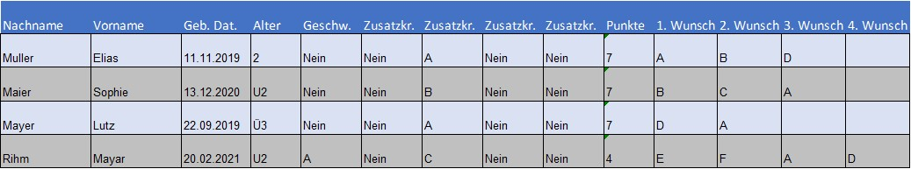

Ein Beispiel für einen vollständigen Datensatz finden Sie oben in der Grafik sowie als Excel hier: <mark>Link</mark>

Obligatorische Angaben sind Name, Geburtsdatum, Alterskohorte und die von den Eltern geäußerten Wunscheinrichtungen (1. bis 12. Wunscheinrichtung[^3]). Wichtig hierbei ist, dass ein Dropdown Menü für die Namen der Einrichtungen verwendet wird. Auch kleinste Abweichungen in der Schreibweise interpretiert die Software so, als ob es sich um eine weitere Kita handelt. Optional können zudem noch eine ID und das Geschlecht in KitaMatch angezeigt werden. Wenn Sie einen Kriterienkatalog in Ihrer Kommune haben, können Sie zudem in der Spalte „Rangordnungspunkte“ die resultierenden Punktewerte pro Kind angeben. Zusätzlich gibt es noch die Möglichkeit, bis zu 6 Zusatzkriterien zu definieren, für die Kinder nur in bestimmten Kitas Zusatzpunkte erhalten. Hierfür schreiben Sie in die jeweilige Zelle einfach den Namen der Kita, in der das Kind jeweils Zusatzpunkte bekommen soll. In Zeile 8 müssen Sie zudem jeweils definieren, wie viele Zusatzpunkte das jeweilige Zusatzkriterium wert ist. Im Beispieldatensatz ist “Zusatzkriterium 1“ genau 1 Punkt wert. Entsprechend erhält beispielsweise Ivy Linnea Mayer (Zeile 34) im Kath. Kindergarten 1 Zusatzpunkt.

Wenn Sie Ihrem Systemadministrator diese Daten zur Verfügung gestellt haben, erstellt dieser die entsprechende „Umgebung“ in KitaMatch, also die auf Ihre Kommune zugeschnittene Webseite. Dann können Sie die Bewerberlisten zunächst auf Vollständigkeit und Plausibilität prüfen, bevor Sie diese den Kitaleitungen bereitstellen. Diese Bewerberlisten beruhen auf dem zugrunde gelegten Kriterienkatalog und die entsprechend ermittelten Punktwerte pro Kind. Bei Punktgleichheit sortiert das Programm automatisch das ältere Kind einen Platz vor dem anderen (jüngeren) Kind. 

---

## Systemanforderungen

Um das System zuverlässig nutzen zu können, empfehlen wir die neueste Version von Google Chrome, Firefox oder Microsoft Edge zu verwenden. Um sich im System einzuloggen, benötigen Sie folgende Informationen:

  1. Einen Link zur Website
  2. Die Login-Informationen (E-Mail-Adresse und Passwort)

Diese erhalten Sie vom Systemadministrator.

---

## Systemzugang

Wenn Sie den Link zum System öffnen, werden Sie aufgefordert, E-Mail-Adresse und Passwort einzugeben. Nutzen Sie dafür bitte die vom Systemadministrator zur Verfügung gestellten Login-Daten. Anschließend drücken Sie auf Login.

<small>Abbildung: Login-Menü</small>
  

- Vergessenes Passwort zurücksetzen:
  Falls Sie das Passwort oder die E-Mail-Adresse verloren oder vergessen haben, kontaktieren Sie bitte den Administrator.

--- 

## Navigation

Sie können die KitaMatch-Umgebung über die permanente Navigationsleiste oben auf der Benutzeroberfläche und über die Buttons auf der Übersichtsseite navigieren.

- Durch Klicken der KitaMatch-Fläche links  in der Leiste gelangen sie zur Übersichtsseite.
- Hier haben Sie direkten Zugang zum Zuteilungsverfahren (Zuteilung), zur Bewerberliste (Bewerber) und zur Liste aller Kitagruppen (Kitagruppen).
- Die letzteren zwei Seiten erreichen Sie auch direkt durch Klicken der Felder Kitagruppen und Bewerber in der Navigationsleiste.
- Rechts in der Leiste kommen sie zu dem Dropdown-Menü “Benutzer”. Hierüber können Sie einsehen mit welcher Benutzer-Email-Adresse Sie eingeloggt sind, ihr Passwort ändern und sich abmelden.

<small>Abbildung: Übersichtsseite</small>
  
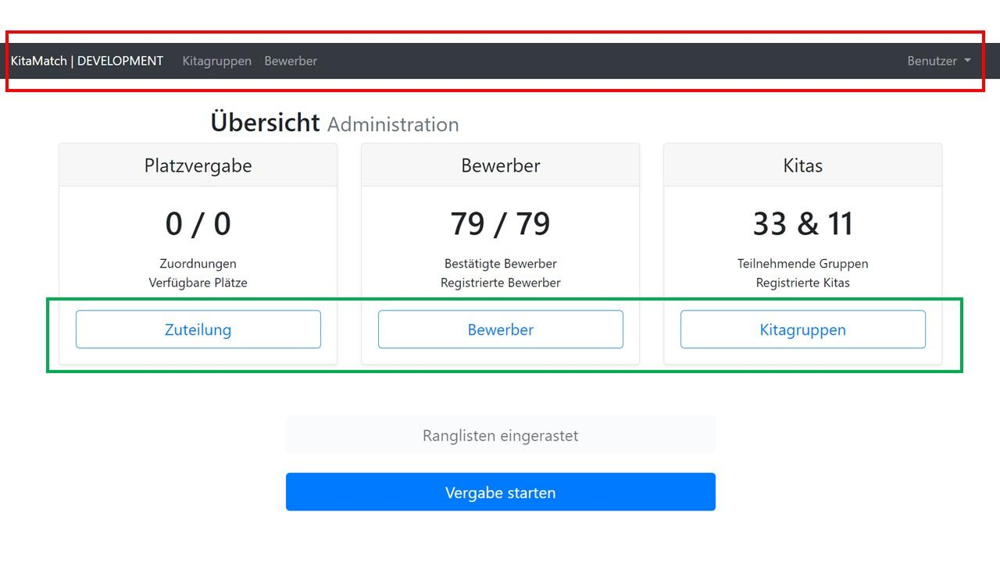

### Zuteilung

Auf der Startseite (bzw. nach Klicken auf “Zuteilung“) sehen Sie eine Übersicht der aktuellen Zuordnungen im Verfahren. Bevor das Verfahren startet, ist diese Liste noch leer. Dann gibt es, wie in der obigen Abbildung "Übersichtsseite", logischerweise noch 0 Zuordnungen. 

Während des Verfahrens sehen Sie hingegen eine Liste mit den aktuellen Zuordnungen, sowie weiter unten eine Liste aller Kinder, die aktuell noch nicht zugeordnet sind. 

Bei den Zuordnungen gibt es 2 Möglichkeiten: “Finale Zuordnung“ bedeutet, dass das jeweilige Kind seiner Erstwunschkita zugeordnet wurde, und entsprechend keine Möglichkeit besteht, dass das Kind im Laufe des Verfahrens noch ein besseres Angebot bekommt. Im Gegensatz dazu bedeutet “Gehaltenes Angebot“, dass das Kind aktuell der jeweiligen Kita vorläufig zugesagt hat, es aber prinzipiell sein kann, dass das Kind im Laufe des Verfahrens noch ein “besseres“ Angebot bekommt, und deshalb das aktuell gehaltene Angebot noch ablehnen könnte. Diese beiden Listen von versorgten und bisher unversorgten Kindern können jeweils über den Export Button in ein Excel Dokument überführt werden. 

**Liste der gematchten Kindern**:

Per Mausklick kann die Projektleitung bzw. das Jugendamt eine Excel-Liste generieren mit der Übersicht, welches Kind in welcher Kita bzw. FB KTP einen Platz erhält. Auf dieser Basis können die Verantwortlichen nun die „tatsächlichen“ Zu- und Absagen in der Praxis (z.B. über ein Anmeldeportal) erteilen. 

**Liste der unversorgten Kinder**: 

Eine weitere hilfreiche, zu generierende Liste ist die mit den Kindern, die noch einen Platz benötigen und bisher unversorgt sind. Dies kann daran liegen, dass die Eltern zu wenig Alternativen ausgewählt haben. Demzufolge würden sie am liebsten in den angegebenen Wunscheinrichtungen einen Platz erhalten wollen und wenn das nicht klappt, lieber gar keinen anderen Platz. 

**Übersicht der Kitas bzw. Fachberatung der Kindertagespflege mit freien Plätzen**:

Es kann auch sein, dass Kitas bzw. FB KTP am Ende des Matchings noch freie Plätze haben. In diesem Fall hatten sie von Anfang zu wenig Bewerber:innen. Diese freien Plätze würden dann in der Praxis mit den Kindern belegt werden können, die im Matching keinen Platz erhalten haben und sich dann für diese Einrichtungen vormerken lassen. 
 
<small>Abbildung: Aktuelle Zuordnungen</small>

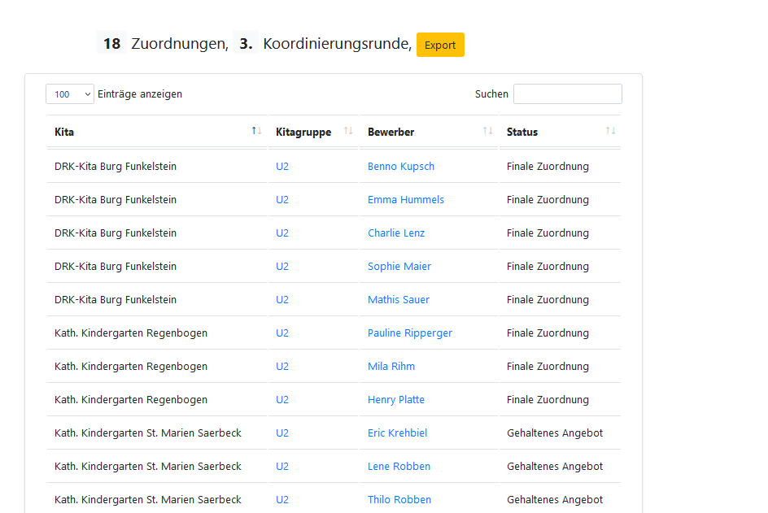

<small>Abbildung: Nicht zugeordnete Bewerber</small>

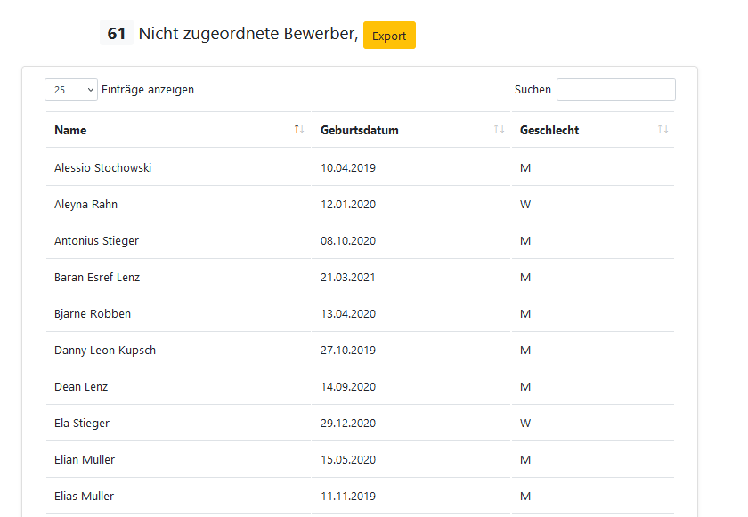

### Bewerber

Nach einem Klick auf “Bewerber“ landet man auf der Übersicht über alle Bewerber/Kinder, die an dem Verfahren teilnehmen.

Der “Status“ ist bei allen final zugeordneten Kindern “26“, und bei allen anderen “22“. Bei einem Klick auf “Einsehen“ erhält man weitere Information des jeweiligen Kindes. Hier möchten wir insbesondere auf die “Rangliste der Wunscheinrichtungen“ aufmerksam machen. Diese Rangliste beschreibt die von den Eltern abgegebenen Präferenzen über die Kitas.
 
<small>Abbildung: Übersicht aller Bewerber/Kinder, die am Verfahren teilnehmen</small>

{:height="500px" width="500px"}

<small>Abbildung: Rangliste der Wunscheinrichtungen</small>

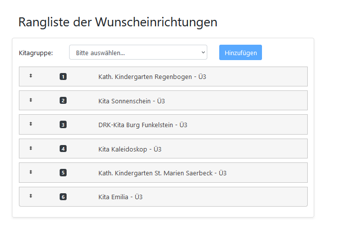

### Kitagruppen

Nach einem Klick auf “Kitagruppen“ landet man auf der Übersicht über alle Kitagruppen. Durch Klicken auf die jeweilige Kita (bzw. die einzelne Alterskohorte einer Kita) kommen Sie zu der Ansicht, die die Kitaleitung während des Verfahrens haben. Dieser Teil der Software wird im nächsten Kapitel erklärt, der sowohl die Projektmanagerin als auch die Kitaleitungen adressiert, die an dem Verfahren teilnehmen.

<small>Abbildung: Liste aller Kitagruppen</small>

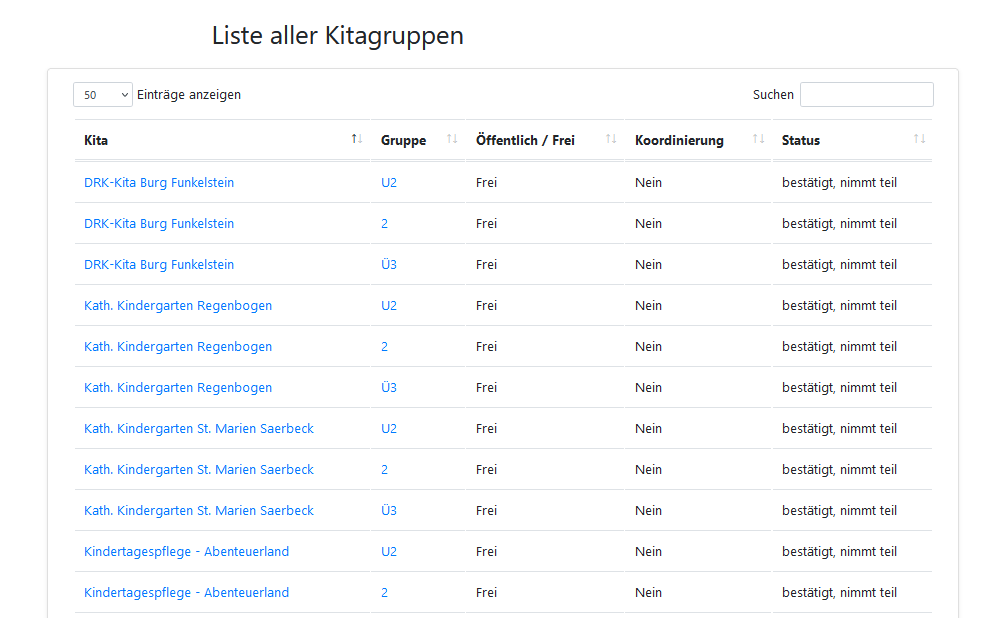

---

## KitaMatch/Das Vergabeverfahren aus Sicht der Kita-Leitungen 

Dieses Kapitel richtet sich an die Leitungen von Kitas oder Trägern, welche an dem Verfahren teilnehmen. 

### Systemanforderungen

Um das System zuverlässig nutzen zu können, empfehlen wir die neueste Version von Google Chrome, Firefox oder Microsoft Edge zu verwenden. Um sich im System einzuloggen benötigen Sie folgende Informationen:

  1. Einen Link zur Website
  2. Die Login-Informationen (E-Mail-Adresse und Passwort)

Diese erhalten Sie von der Projektmanagerin Ihrer Kommune.  [Weitere Informationen zum Projektmanagement](/docs/Andere-Themen/Projektmanagement)

### Systemzugang

- Login-Menü:
  Wenn Sie den Link zum System öffnen, werden Sie aufgefordert, E-Mail-Adresse und Passwort einzugeben. Nutzen Sie dafür bitte die vom Systemadministrator zur Verfügung gestellten Login-Daten. Anschließend drücken Sie auf Login.

<small>Abbildung: Login-Menü aus Sicht der Kitaleitungen</small>

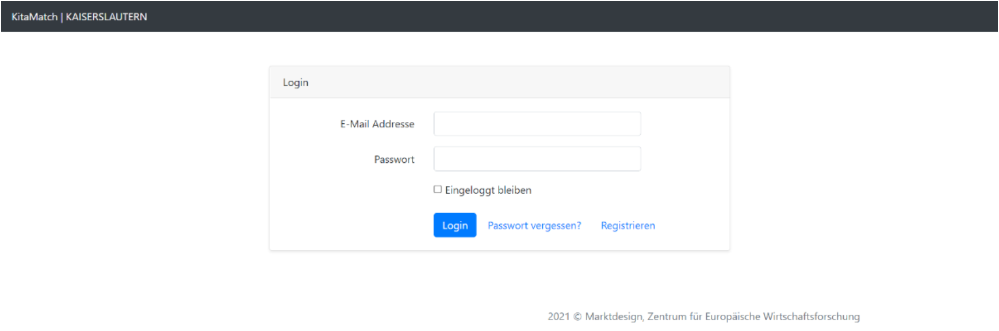

- Vergessenes Passwort zurücksetzen:
  Falls Sie das Passwort oder die E-Mail-Adresse verloren oder vergessen haben, kontaktieren Sie bitte Ihre Kommune.

### Navigation

Nachdem Sie sich in die Software eingeloggt haben, erscheint eine erste Übersichtsseite: Hier sollten Sie zuerst den Namen Ihrer Kita überprüfen, und bei Unklarheiten Ihre Kommune kontaktieren. 

Unten finden Sie dann 3 blaue Felder mit den unterschiedlichen Altersgruppen, auf die Sie jeweils klicken können (wir empfehlen das mit einem Rechtsklick zu tun, sodass Sie für jede Altersgruppe ein separates Tab öffnen können).

{: .note-title}
> Wichtig
>
> Falls Sie zu irgendeinem Zeitpunkt nicht mehr wissen, wo Sie sich gerade befinden, können Sie einfach durch einen Klick auf „KitaMatch“ ganz links oben zurück zu dieser Seite kommen.

<small>Abbildung: Übersichtsseite aus Sicht der Kitaleitungen</small>

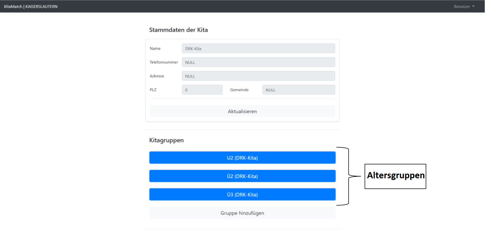

**Freie Plätze einpflegen**

Wenn Sie auf eine der Gruppen geklickt haben, erscheint eine Übersicht über die jeweilige Gruppe. Hier müssen Sie die freien Plätze einpflegen, die Sie in der jeweiligen Altersklasse zur Verfügung haben. Dazu geben Sie einfach die konkrete Zahl ein (im Beispiel unten also “9“), und klicken auf “Änderungen speichern“. Dies müssen Sie jeweils in jeder Altersgruppe einmal machen. Wichtig zu beachten ist, dass einmal eingepflegte Zahlen nicht mehr reduziert, sondern nur noch erhöht werden können.[^4].

<small>Abbildung: Freie Plätze einpflegen</small>

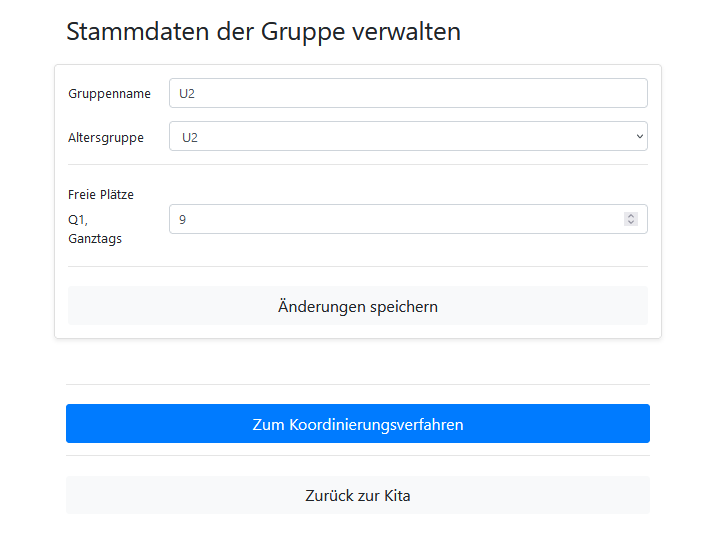{:height="500px" width="500px"}

### Bewerberliste und Koordinierungsverfahren

Wenn Sie im vorigen Schritt auf “Zum Koordinierungsverfahren“ geklickt haben, kommen Sie zur wichtigsten Seite, auf der Sie einerseits eine Übersicht über die Kinder bekommen, die sich bei Ihnen beworben haben. Andererseits können Sie auf dieser Seite den Kindern Angebote machen, und im Laufe des Verfahrens Feedback erhalten, ob ein Kind ein Angebot annimmt oder ablehnt. Das Verfahren besteht aus mehreren Runden, in denen Sie Kindern Angebote machen können. Nach jeder Runde erhalten Sie dann Feedback, welche Kinder Ihnen zugeteilt wurden.

In den folgenden 3 Kapiteln wird Ihnen vermittelt, was Sie auf dieser Seite vor dem Matching Day, während einer Runde und nach einer Runde erwartet. 

**Vor dem Matching Day**

Die Seite ist prinzipiell so aufgebaut, dass oben die wichtigsten Informationen zusammengefasst werden, und unten 2 Tabellen aufbereitet sind. In der ersten Tabelle finde Sie eine Übersicht aller Kinder, denen ein verbindliches Angebot gemacht wurde. Diese ist vor der ersten Runde natürlich noch leer. Außerdem finden Sie unten eine Tabelle mit allen Bewerbern, die sich in der Kita in der jeweiligen Altersgruppe beworben haben. Die Kinder sind, falls es einen abgestimmten Kriterienkatalog in Ihrer Kommune gibt, bereits nach diesem Kriterienkatalog vorsortiert. Gibt es keinen abgestimmten Kriterienkatalog, erfolgt die Vorsortierung nach Alter, wobei die ältesten Kinder immer oben stehen. Sollten Sie an dieser Reihenfolge noch Veränderungen vornehmen wollen, können Sie auf “Manuelle Rangliste klicken“, und danach die Kinder manuell nach oben oder unten ziehen, indem Sie auf ein bestimmtes Kind klicken und währenddessen die Maus hoch oder runter bewegen. Eine Anpassung der Reihenfolge der Kinder auf der Liste bedeutet eine Abweichung vom Kriterienkatalog. Sicherlich gibt es in der Praxis Gründe, die dies erfordern. Letztlich ist es auch im Rahmen der Trägerautonomie das Recht der Träger, diese Änderungen vorzunehmen. Allerdings sollte dieser Schritt transparent und nachvollziehbar nach Absprache mit dem Jugendamt erfolgen. 

<small>Abbildung: Vor dem Matching-Day</small>

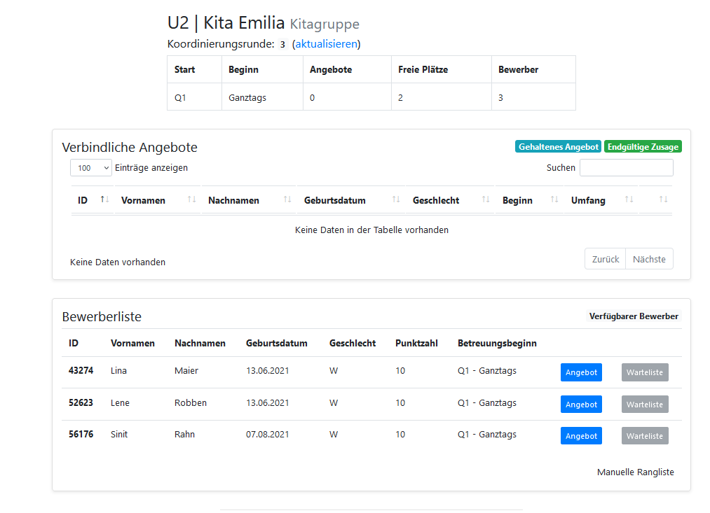

**Während einer Vergaberunde**

Wenn der Matching Day durch die Projektmanagerin eingeläutet wurde, können Sie anfangen, den Kindern Angebote zu unterbreiten. Hierfür klicken Sie auf das blau hinterlegte “Angebot“ Feld und bestätigen das jeweilige Angebot, indem Sie auf das ebenso blau hinterlegte “Q1, Ganztags“ Feld klicken. 

<small>Abbildung: Angebote unterbreiten</small>

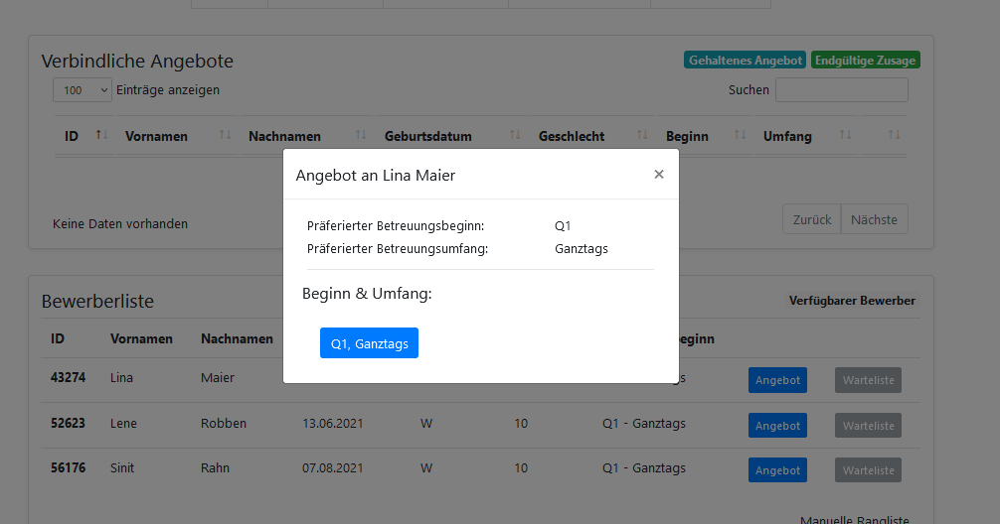

Dies wiederholen Sie so oft, bis Sie keine weiteren Platzangebote mehr vergeben können oder wollen[^5]. Wenn das der Fall ist, sagen Sie bitte dem/der Projektmanager:in Ihrer Kommune Bescheid, dass Sie mit der aktuellen Runde fertig sind. 

Dadurch rücken die Kinder, denen Sie ein Angebot gemacht haben, in die obere Tabelle, und sind vorerst blau hinterlegt. Diese Angebote lassen sich so lange zurücknehmen, bis der/die Projektmanager:in den zentralen “Vergabe starten Button“ geklickt hat. 

Alle Kinder, denen Sie zu einem gewissen Zeitpunkt kein Angebot mehr machen können - zum Beispiel weil Sie zu diesem Zeitpunkt keine weiteren freien Plätze mehr haben - erscheinen rot.  

Sofern die Einrichtung keine freien, zu belegenden Plätze hat, setzen Sie das Matching für diese Altersgruppe aus. 

Falls Sie mehr freie, zu belegende Plätze als Bewerber:innen haben, können Sie kein Angebot abgeben, und die Plätze bleiben zunächst frei. Diese freien Plätze können im Nachgang des Matchings von den Kindern, die im Zuge des Matchings keinen Platz erhalten haben, oder von neu angemeldeten Kindern belegt werden (Abstimmungsbedarf mit dem Jugendamt). 

<small>Abbildung: Während des Matching-Days</small>

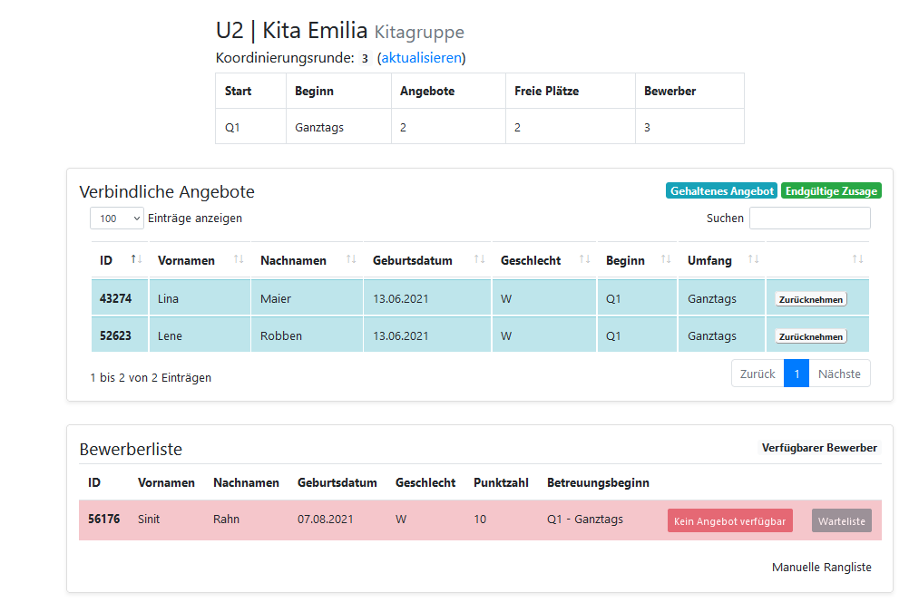

Wenn alle Kitaleitungen mit einer Runde fertig sind, klickt die Projektleiterin auf den zentralen, blau hinterlegten „Vergabe starten Button“ auf der Hauptseite. 

**Nach einer Vergaberunde**

Nachdem der/die Projektleiter:in den “Vergabe starten" Button geklickt hat, müssen Sie zunächst die Seite aktualisieren. Hierfür klicken Sie auf „aktualisieren“ oben auf der Seite (in blauer Schrift), oder einfach die Tastenkombination “Strg“ und "F5" auf Ihrer Tastatur. 

Jetzt können Sie sehen, wie sich die Kinder, denen Sie in der vorigen Runde ein Angebot gemacht haben, entschieden haben. Prinzipiell gibt es 3 Möglichkeiten:

  1. Das Kind erscheint grün in der oberen Tabelle. Dies bedeutet, dass das Kind Ihr Angebot angenommen hat, und Sie sicher sein können, dass es im Laufe des Verfahrens auch bei Ihnen bleibt und keiner anderen Kita zusagt.
  2. Das Kind erscheint blau in der oberen Tabelle. Dies bedeutet, dass das Kind Ihr Angebot vorläufig, aber noch nicht endgültig angenommen hat. Dies liegt daran, dass Sie nicht die erste Wahl des Kindes sind, und es entsprechend sein kann, dass das Kind in einer der nächsten Runden ein Angebot von seiner Erstwunschkita erhält. Die Erfahrung zeigt jedoch, dass ein Kind, das ein Angebot vorläufig annimmt, in ca. 90% der Fälle auch am Ende des Verfahrens Ihnen zugeordnet wird.
  3. Das Kind erscheint rot in der unteren Tabelle. Dies bedeutet, dass Sie dem Kind aktuell kein Angebot machen können, was an 2 Dingen liegen kann: Entweder Sie haben keine Kapazität (mehr), um dem Kind ein Angebot zu machen, oder das Kind hat ein Angebot einer Kita, zu der das Kind lieber gehen würde, erhalten. 

<small>Abbildung: Verbindliche Angebote</small>

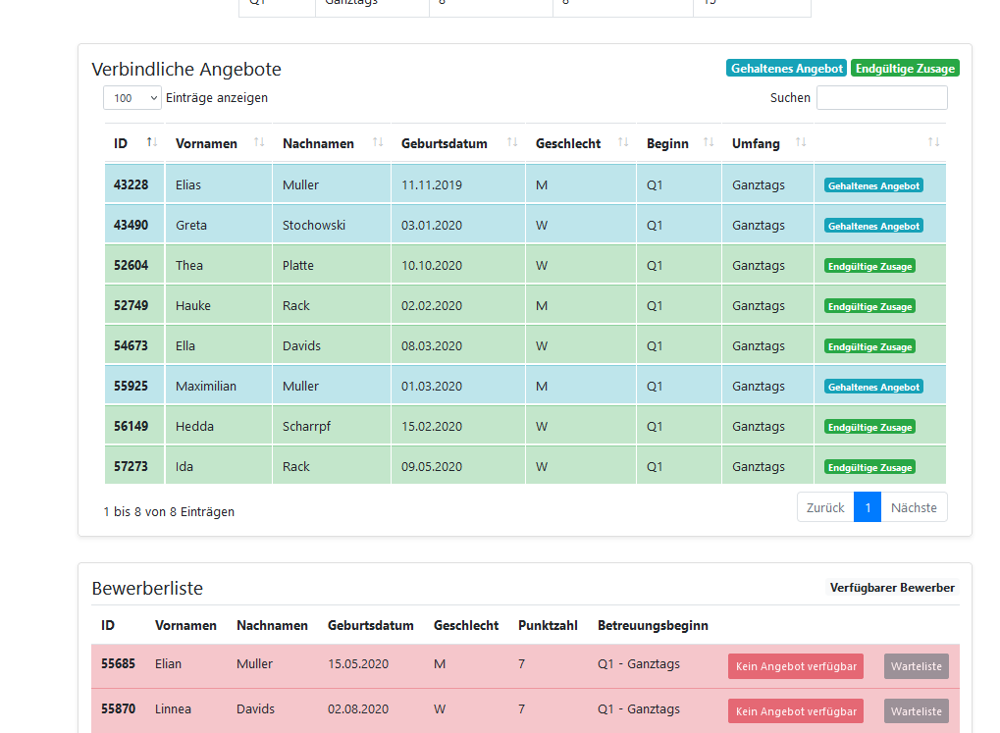

Wenn Sie nach einer Runde noch freie Kapazitäten und Kinder in Ihrer Liste haben, denen Sie ein Angebot machen können, wiederholen Sie den Vorgang der Platzvergabe und geben der Projektleiterin wieder Bescheid, wenn Sie fertig sind. Dies wird so lange wiederholt, bis alle Kitas entweder keine freien Plätze, oder keine Kinder mehr in ihrer Liste haben, denen sie noch Angebote unterbreiten können.

**Ende des Verfahrens**

Nachdem die Projektleiterin auf den “Vergabe starten Button“ geklickt hat, teilt sie den Kitaleitungen jeweils mit, dass diese ihre Seite aktualisieren sollen. Ab der 4. Runde sollte die Projektleiterin dann zudem die Kitaleitungen fragen, ob diese noch weitere Angebote machen können. Das Verfahren endet genau dann, wenn in einer bestimmten Runde alle Kitaleitungen diese Frage mit “nein“ beantworten. 

---

[^3]: Wenn weniger als 12 Wünsche geäußert werden, müssen Sie die weiteren Zellen einfach leer lassen.

[^4]: Falls eine Reduzierung doch einmal notwendig sein sollte, kontaktieren Sie bitte die Kommune bzw. den Systemadministrator.

[^5]: Wenn man in einer bestimmten Runde nicht für jeden freien Platz ein Angebot macht, hat man in unserem Verfahren keinen Nachteil.
