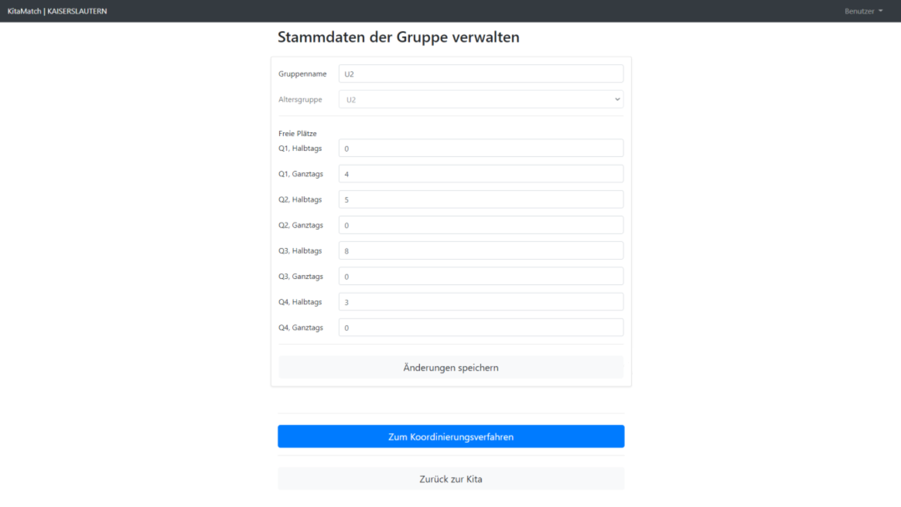
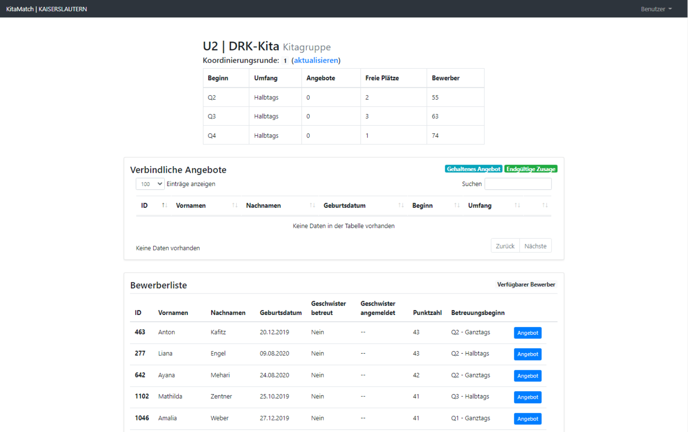

# Mögliche Erweiterungen
{: .no_toc }
## Verschiedene Betreuungsumfänge und Betreuungszeitpunkte
{: .no_toc }

In diesem Kapitel gehen wir auf die Möglichkeit ein, unterschiedliche Arten von Plätzen zu vergeben. Dies kann, zusätzlich zu den verschiedenen, auch schon im vorherigen Kapitel berücksichtigten Alterskohorten in zwei Dimensionen erfolgen: Einerseits können Plätze vergeben werden, die zu unterschiedlichen Zeitpunkten frei werden. Dies wird in KitaMatch mit bis zu vier unterschiedlichen Quartalen abgebildet, welche Q1, Q2, Q3 und Q4 genannt werden. Andererseits können auch unterschiedliche Plätze im Hinblick auf den Betreuungsumfang vergeben werden:  Ganztags- und Halbtagsplätze. 

Im Folgenden gehen wir darauf ein, was sich im Vergleich zum [Standardfall](/docs/Uebersicht-Software/Der-Standardfall) aus dem vorigen Kapitel ändert.

## Inhalt
{: .no_toc .text-delta }

1. TOC
{:toc}

---

## Welche Daten benötigt KitaMatch?

Zusätzlich zu den Daten aus dem Standardfall muss in die Excel-Liste nun noch pro Kind eingetragen werden, welchen Betreuungsbeginn und -umfang sich die Eltern jeweils wünschen. 

Zusätzlich benötigt KitaMatch pro Kind Informationen über die Gewichtung zwischen Wunschkita sowie Betreuungszeitpunkt und -umfang. Hierzu gibt es unterschiedliche Herangehensweisen: 
  1. Sie können selbst die Entscheidung treffen, wie Eltern zwischen den drei Dimensionen priorisieren. Zum Beispiel könnte diese Entscheidung so aussehen, dass Eltern ein Platz zum gewünschten Zeitpunkt immer am wichtigsten ist und der gewünschte Betreuungsumfang das zweitwichtigste Kriterium ist. Dies würde bedeuten, dass Eltern in der Software immer der Kita eine Zusage machen, die ihnen ein Angebot für die gewünschte Kombination aus Betreuungsstart und -umfang macht, entsprechend spielt dann die Präferenz zwischen den Kitas (also erste, zweite, dritte etc. Wunschkita) keine so große Rolle. Grundsätzlich sind hier alle möglichen Kombinationen wählbar.
  2. Sie fragen die Präferenzen der Eltern zwischen den Dimensionen zumindest teilweise ab: Hierzu gibt es zwei voreingestellte Fragen in KitaMatch, die genutzt werden können: „Wären Sie bereit, mindestens drei Monate auf ihre Wunschkita zu warten, wenn dort zum Wunschzeitpunkt noch kein Platz frei ist?“ und: „Ist für Sie grundsätzlich auch der andere Betreuungsumfang akzeptabel?“ Auf Basis dieser Antworten können Sie dann eine individualisierte Reihenfolge pro Kind nutzen. Die konkrete Umsetzung besprechen Sie mit der Systemadministration.

## Kitasicht

### Freie Plätze einpflegen

Sollen unterschiedliche Arten von Plätzen vergeben werden, muss entsprechend auch für jede Kombination aus Umfang und Zeitpunkt die Anzahl an freien Plätzen eingepflegt werden. 

<small>Abbildung: Freie Plätze einpflegen<small>
  

### Vor dem Matching-Day

Die obere Abbildung zeigt, welche Arten von Plätzen Sie vergeben, wie viele Plätze Sie dafür jeweils zur Verfügung haben und wie viele Kinder sich prinzipiell für einen Platz interessieren. 

<small>Abbildung: Vor dem Matching-Day<small>

### Während einer Vergaberunde

Wenn Sie nun ein Betreuungsangebot machen, müssen Sie sich entscheiden, welche Art von Platz Sie einem Kind anbieten. Wir empfehlen, den Kindern immer zuerst den von ihnen gewünschten Platz anzubieten, und man nur für den Fall, dass dieser nicht mehr vergeben werden kann, sollte dem Kind einen anderen Platz angeboten werden.

### Nach einer Vergaberunde

Zusätzlich zu den oben genannten Fällen kann es nun auch sein, dass ein Kind einfach blank in Ihrer Bewerberliste erscheint. Dies passiert, wenn das Kind zwar ein besseres Angebot bekommen hat, Sie ihm aber prinzipiell noch ein passenderes Angebot machen können, zum Beispiel zum gewünschten Betreuungsbeginn. 
