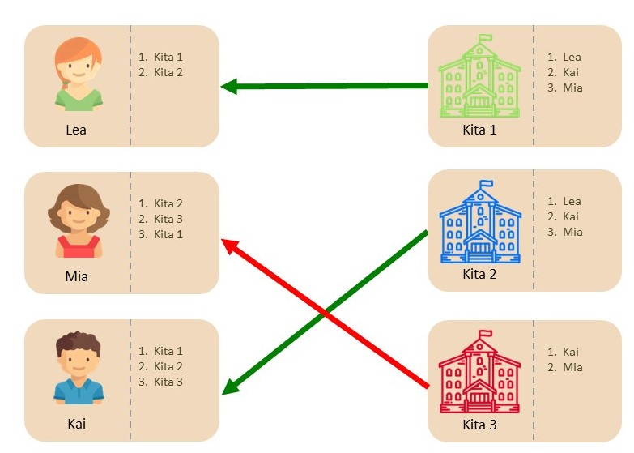

# Mögliche Erweiterungen
{: .no_toc }

## Inhalt
{: .no_toc .text-delta }

1. TOC
{:toc}

---

## Verschiedene Betreuungsumfänge und Betreuungszeitpunkte

In diesem Kapitel gehen wir auf die Möglichkeit ein, unterschiedliche Arten von Plätzen zu vergeben. Dies kann, zusätzlich zu den verschiedenen Alterskohorten, die auch schon im vorhergien Kapitel berücksichtigt werden, in zwei Dimensionen erfolgen: Einerseits können Plätze vergeben werden, die zu unterschiedlichen Zeitpunkten frei werden. Dies wird in KitaMatch mit bis zu 4 unterschiedlichen Quartalen abgebildet, welche Q1, Q2, Q3 und Q4 genannt werden. Andererseits können auch unterschiedliche Plätze im Hinblick auf den Betreuungsumfang vergeben werden:  Ganztags und Halbtags Plätze. 

Im Folgenden gehen wir darauf ein, was sich im Vergleich zum Standardfall aus dem vorigen Kapitel ändert.

### Welche Daten benötigt KitaMatch?

Zusätzlich zu den Daten aus dem Standardfall muss in die Excel Liste nun noch pro Kind eingetragen werden, welchen Betreuungsbeginn und Betreuungsumfang sich die Eltern jeweils wünschen. 

Zusätzlich benötigt KitaMatch pro Kind Informationen, wie die Gewichtung zwischen Wunschkita, Betreuungszeitpunkt und Betreuungsumfang ist. Hierzu gibt es unterschiedliche Herangehensweisen: 
  1. Sie können selbst die Entscheidung treffen, wie Eltern zwischen den 3 Dimensionen priorisieren. Zum Beispiel könnte diese Entscheidung so aussehen, dass Eltern ein Platz zum gewünschten Zeitpunkt immer am wichtigsten ist, und der gewünschte Betreuungsumfang das zweitwichtigste Kriterium. Dies würde bedeuten, dass Eltern in der Software immer der Kita eine Zusage machen, die ihnen ein Angebot für die gewünschte Kombination aus Betreuungsstart und Umfang macht, entsprechend spielt dann die Präferenz zwischen den Kitas (also ob 1. Wunsch, 2 Wunsch etc.) keine so große Rolle. Grundsätzlich sind hier alle möglichen Kombinationen wählbar.
  2. Sie fragen die Präferenzen der Eltern zwischen den Dimensionen zumindest teilweise ab: Hierzu gibt es 2 voreingestellte Fragen in KitaMatch, die genutzt werden können: „Wären Sie bereit, mindestens 3 Monate auf ihre Wunschkita zu warten, wenn dort zum Wunschzeitpunkt noch kein Platz frei ist?“ Und: „Ist für Sie grundsätzlich der andere Betreuungsumfang auch akzeptabel?“ Auf Basis dieser Antworten können Sie dann eine individualisierte Reihenfolge pro Kind nutzen. Wie dies dann umgesetzt wird, besprechen Sie mit Ihrem Systemadministrator.

### Kita-Sicht

#### Freie Plätze einpflegen

Sollen unterschiedliche Arten von Plätzen vergeben werden, muss entsprechend auch für jede Kombination aus Umfang und Zeitpunkt die Anzahl an freien Plätzen eingepflegt werden, siehe <mark>Screenshot XY</mark>. 

<mark>Abbildung 8:</mark>

#### Vor dem Matching Day

Sie sehen nun in der oberen Übersicht, welche Arten von Plätzen Sie vergeben, wie viele Plätze Sie dafür jeweils zur Verfügung haben, und wie viele Kinder sich prinzipiell für einen Platz interessieren. 

<mark>Abbildung 8:</mark>

#### Während einer Runde 

Wenn Sie nun ein Betreuungsangebot machen, müssen Sie sich entscheiden, welche Art von Platz Sie einem Kind anbieten. Wir empfehlen hier den Kindern immer zuerst den von ihnen gewünschten Platz anzubieten, und man nur für den Fall, dass man einen solchen Platz nicht mehr vergeben kann, dem Kind einen anderen Platz anbietet.

#### Nach einer Runde 

Zusätzlich zu den oben genannten Fällen kann es nun auch sein, dass ein Kind einfach wieder “weiß“ in Ihrer Bewerberliste erscheint. Dies passiert, falls das Kind zwar ein besseres Angebot bekommen hat, Sie aber dem Kind prinzipiell noch ein passenderes Angebot machen können, zum Beispiel zum gewünschten Betreuungsbeginn. 
