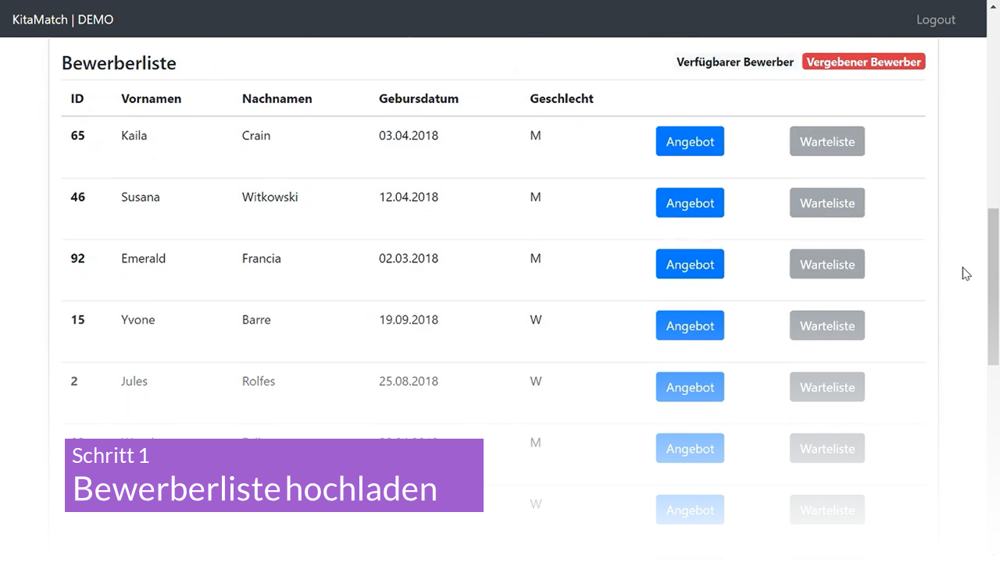

# Übersicht Software - schrittweise Anleitung zum Einsatz der Software KitaMatch in der Praxis

Dieses Kapitel gibt eine Übersicht über die entwickelte KitaMatch-Software. Zuerst wird der [Standardfall](/docs/Uebersicht-Software/Der-Standardfall) behandelt, bei dem alle zu vergebenden Plätze den gleichen Umfang haben und zum gleichen Zeitpunkt frei werden. Es können pro Einrichtung Plätze für bis zu drei Alterskohorten (z. B. unter Zweijährige, Zweijährige, über Dreijährige) vergeben werden, die in KitaMatch als „U2“, „Ü2“und „Ü3“ bezeichnet sind. In [Kapitel 3.3](/docs/Uebersicht-Software/Moegliche-Erweiterungen) gehen wir zudem auf die Möglichkeiten ein, Plätze für unterschiedliche Betreuungszeitpunkte und unterschiedliche Betreuungsarten mit KitaMatch zu vergeben.

<!-- Slider main container -->

  <!-- Additional required wrapper -->
  

    <!-- Slides -->
    

    

    

    

    

  <!-- If we need pagination -->
  

  <!-- If we need navigation buttons -->
  

  

Um ein erfolgreiches Projekt umzusetzen, werden zwei Personen in der Verwaltung einer Kommune benötigt: 

  1. Ein/Eine Projektmanager:in, die vor der Vergabe die Kitaleitungen und alle anderen Beteiligten schult, die erforderlichen Daten im richtigen Format sammelt und am Vergabetag die Software anwendet. 

  2. Ein/Eine Systemadministrator:in, der/die im Hintergrund die technische Umsetzung der Software sicherstellt.

Prinzipiell kann auch eine Person beide Rollen übernehmen, dafür muss diese jedoch gewisse IT- und Projektmanagementkenntnisse voraussetzten. Zudem sollte die Person auch ausreichend zeitliche Kapazitäten haben: Gerade im Jahr der Einführung ist mit einem Aufwand von ca. fünf bis zehn Stunden pro Woche je Rolle zu rechnen (für etwa drei bis sechs Monate), bei Übernahme beider Rollen (also Projektmanagement und Systemadministration) verdoppelt sich die wöchentliche Zeit entsprechend.

---

## Inhalt
{: .no_toc .text-delta }

1. [Der Standardfall](/docs/Uebersicht-Software/Der-Standardfall)
2. [Matching-Day](/docs/Uebersicht-Software/Matching-Day)
3. [Mögliche Erweiterungen](/docs/Uebersicht-Software/Moegliche-Erweiterungen)
4. [IT-Guide](/docs/Uebersicht-Software/IT-Guide)
