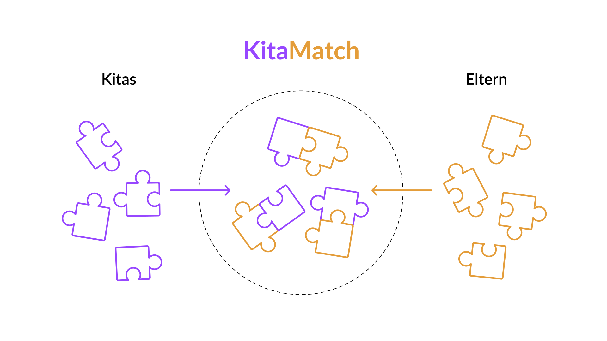
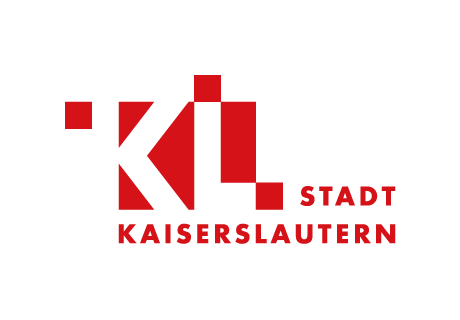
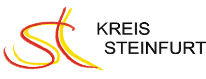
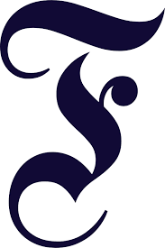

<section class="km-opening km-text-lead">
KitaMatch ist ein Verfahren zur fairen, schnellen und transparenten Vergabe von Kitaplätzen, das Eltern und Kitas bei der Vergabe von Betreuungsplätzen optimal miteinander verbindet.
</section>

## Das Problem

In den meisten deutschen Kommunen führt die Vergabe von freien Plätzen in Kindertagesstätten und der Kindertagespflege zu **Unmut bei Eltern und Kitas**. Dies liegt daran, dass Kitas **kein einheitliches, transparentes Verfahren** nutzen und Eltern sich wiederum oft strategisch verhalten müssen, beispielsweise ob und wann sie sich in einer bestimmten Kita anmelden bzw. dieser zusagen.

## Die Lösung

Das KitaMatch-Verfahren verbindet die Wünsche von Eltern nach Betreuungsplätzen mit den verfügbaren Plätzen von Kitas. Anhand von definierten Vergabekriterien werden so Eltern und Kitas miteinander **gematcht**. [Die Vorteile](/docs/Einfuehrung#die-vorteile-der-algorithmusbasierten-kitaplatzvergabe) sind Fairness, Effizienz, Transparenz und dass die Lösung Open Source ist.

<h2 class="text-center fw-700 fs-5 mb-5">Erfahren Sie hier mehr zum Ablauf</h2>

  <a href="/docs/Einfuehrung" class="btn btn-purple text-center">Zum Ablauf</a>

<section class="mb-7">
  <h2 class="text-center">Vorteile</h2>
  

    

      
      Fair
    

    

      
      Schnell
    

    

      
      Transparent
    

    

      
      Flexibel
    

    

      
      Einfach
    

    

      
      Open Source
    

  

</section>

 

<section>

<!-- Vorteile für Kitas -->
  

    
    

      <h3 class="fw-700 mt-0">Vorteile für Kitas:</h3>
      

        
        
 Die Ablehnung eines Kindes kann damit begründet werden, dass alle vergebenen Plätze mit Kindern besetzt wurden, die bezüglich der Aufnahmekriterien der Kita höher priorisiert waren.

      

      

        
        
 Die Vorsortierung der Bewerber nach den Kriterien des Kriterienkatalogs erleichtert die gerichtsfeste Vergabe für Kitas.

      

      

        
        
 Die dezentrale Vergabe wahrt die Trägerautonomie und erlaubt Flexibilität, z.B. bezüglich Geschlechts- und Altersstruktur der Gruppen.

      

      
Weitere Informationen

      <a href="/docs/Einfuehrung" class="mb-1 km-link-hover">Allgemeine Einführung</a>
      <a href="/assets/KitaMatch_Factsheet_Kitas.pdf">Factsheet Kitas</a>
    

  

  
<!-- Vorteile für Jugendämter -->
  

    
    

      <h3 class="fw-700 mt-5">Vorteile für Jugendämter:</h3>
      

        
        
 Das Jugendamt kann sicher sein, dass alle Kitaplätze mit Kindern besetzt wurden, die bezüglich der Aufnahmekriterien der Kitas höher priorisiert waren als abgelehnte Kinder.

      

      

        
        
Das Gale-Shapley Verfahren ermöglicht eine gerichtsfeste Platzvergabe.

      

      

        
        
Es fallen keine Lizenzkosten an. Es entsteht kein Lock-in Effekt wie bei proprietärer Software.

      

      
Weitere Informationen

      <a href="/docs/Einfuehrung" class="mb-1 km-link-hover">Allgemeine Einführung</a>
      <a href="/assets/KitaMatch_Factsheet_Jugendamt.pdf">Factsheet Jugendämter</a>
    

  

  <!-- Vorteile für Eltern -->

  

    
    

      <h3 class="fw-700 mt-0">Vorteile für Eltern:</h3>
      

        
        

          Die Ablehnung durch eine Kita ist damit nachzuvollziehen, dass alle vergebenen Plätze mit Kindern besetzt wurden, die bezüglich der Aufnahmekriterien der Kita höher priorisiert waren als das eigene Kind.
        

      

      

        
        
Die Platzvergabe erfolgt zwei Wochen nach dem Stichtag für die Vormerkung. Danach können Eltern mit einer Zu- oder Absage innerhalb einer Woche rechnen.

      

      

        
        
Viele Kitas in der Vormerkung anzugeben, bedeutet keinen Nachteil, sondern erhöht die Chance, einen Platz zu erhalten. Darüber hinaus lohnt es sich, die Wunsch-Kita auf Platz eins anzugeben. Es sind also keine strategischen Erwägungen notwendig.

      

      
Weitere Informationen

      <a href="/docs/Einfuehrung">Allgemeine Einführung</a>
    

  

</section>

 

<section>
  <h2 class="text-center">Wer steckt dahinter?</h2>
  

    
    
  

  <h2 class="text-center">Unterstützt von</h2>
  

    
  

  
  <h2 class="text-center mb-6">Dokumente zum Download</h2>
  

    

      Manual
      <a href="/assets/KitaMatch_Manual.pdf" class="btn btn-purple">Herunterladen</a>
    

    

      Wegweiser
      <a href="#" class="btn btn-purple">Herunterladen</a>
      

  

  <h2 class="text-center">Kontakt</h2>
  

    

      Bei Fragen und Anmerkungen melden Sie sich gern beim KitaMatch-Team.
      <a href="mailto:thilo.klein@zew.de" class="btn btn-purple">E-Mail schreiben</a>
    

  

</section>

## Unsere Projekte

{:style="text-align:center;"}
[{:height="150px" width="150px"}](https://www.kaiserslautern.de/buerger_rathaus_politik/medienportal/pressemitteilungen/060195/index.html.de)
[{:height="200px" width="200px"}](https://www.kreis-steinfurt.de/kv_steinfurt/Kreisverwaltung/%C3%84mter/Jugendamt/Kreis%20STEP/)

## In der Presse

<section>
  

    
    <b>WirtschaftsWoche</b>
    <a href="https://www.wiwo.de/politik/deutschland/hilfreiche-software-kita-match-ein-kitaplatz-per-algorithmus/27890190.html">„Kita-Match“: Ein Kitaplatz per Algorithmus</a>

    
    
    <b>WirtschaftsWoche</b>
    <a href="https://www.wiwo.de/my/politik/konjunktur/vwl-marktdesign-oekonomie-ohne-elfenbeinturm/25470414.html?ticket=ST-14212654-6IVplpejhVf9Uz4Iv59q-ap1">Marktdesign: Ökonomie ohne Elfenbeinturm – der neue Kitaalgorithmus</a>
 
    
    
    <b>FAZ</b>
    <a href="https://www.faz.net/aktuell/wirtschaft/wie-ein-algorithmus-kitaplaetze-fairer-vergeben-soll-16510418.html">Gegen den Kita-Frust – wie ein Algorithmus Kitaplätze fairer vergeben soll</a>

    
    
    <b>FAZ</b>
    <a href="https://www.faz.net/aktuell/wirtschaft/kinderbetreuung-raus-aus-der-kita-warteschlange-15053793.html">Raus aus der Kita-Warteschlange</a>
  

</section>
<section class="text-center mt-10">

 Dieses Werk ist lizenziert unter einer <a rel="license" href="http://creativecommons.org/licenses/by-sa/3.0/de/">Creative Commons Namensnennung - Weitergabe unter gleichen Bedingungen 3.0 Deutschland Lizenz</a>.

</section>
