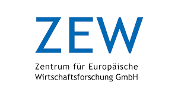
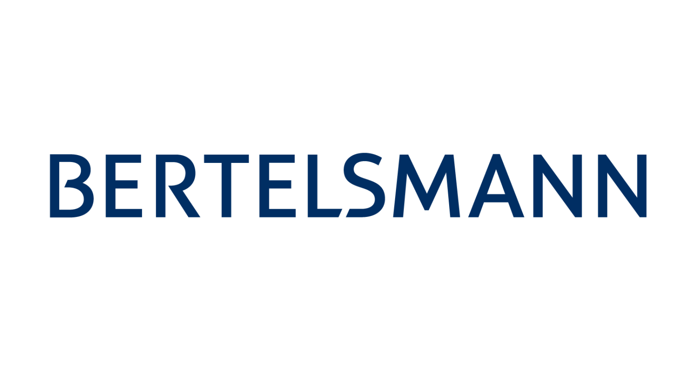

    Koordinierte Kitaplatzvergabe 
    für Ihre Stadt. 
     
    <a href="mailto:thilo.klein@zew.de" class="button">Kontaktieren Sie uns!</a>

    
## Kitaplatzvergabe in 5 Schritten

      <figure>
          
          
          
          
          
      </figure>

## Vorteile im Überblick

    

        

            
        

        

            SCHNELL: 
            Platzvergabe erfolgt in wenigen Stunden. Unnötige Wartezeiten werden eliminiert
        

    

    

        

            
        

        

            SCHNELL: 
            Platzvergabe erfolgt in wenigen Stunden. Unnötige Wartezeiten werden eliminiert
        

    

 

    

        

            
        

        

            SCHNELL: 
            Platzvergabe erfolgt in wenigen Stunden. Unnötige Wartezeiten werden eliminiert
        

    

    

        

            
        

        

            SCHNELL: 
            Platzvergabe erfolgt in wenigen Stunden. Unnötige Wartezeiten werden eliminiert
        

    

 

    

        

            
        

        

            SCHNELL: 
            Platzvergabe erfolgt in wenigen Stunden. Unnötige Wartezeiten werden eliminiert
        

    

    

        

            
        

        

            SCHNELL: 
            Platzvergabe erfolgt in wenigen Stunden. Unnötige Wartezeiten werden eliminiert
        

    

### Gefördert durch
{:style="text-align:center;"}
[{:height="200px" width="200px"}](https://www.zew.de/)
[{:height="200px" width="200px"}](https://www.bertelsmann-stiftung.de/de/startseite)
[{:height="150px" width="150px"}](https://www.leibniz-gemeinschaft.de/)

### Unsere Projekte
{:style="text-align:center;"}
[{:height="200px" width="200px"}](https://www.kreis-steinfurt.de/kv_steinfurt/Home/)
[{:height="150px" width="150px"}](https://www.kaiserslautern.de/)

