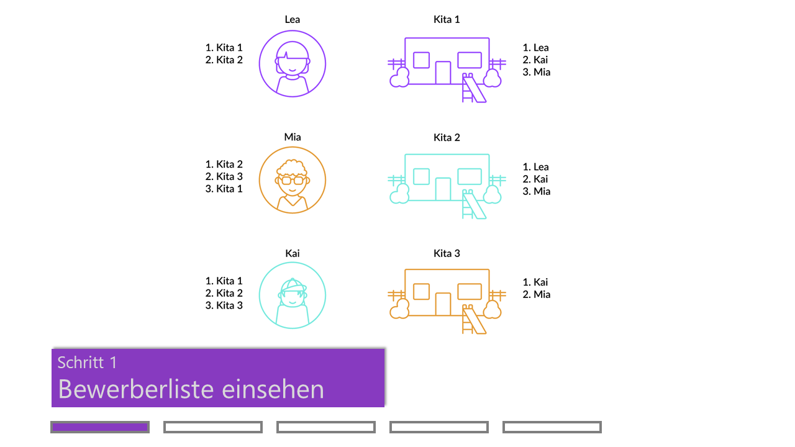
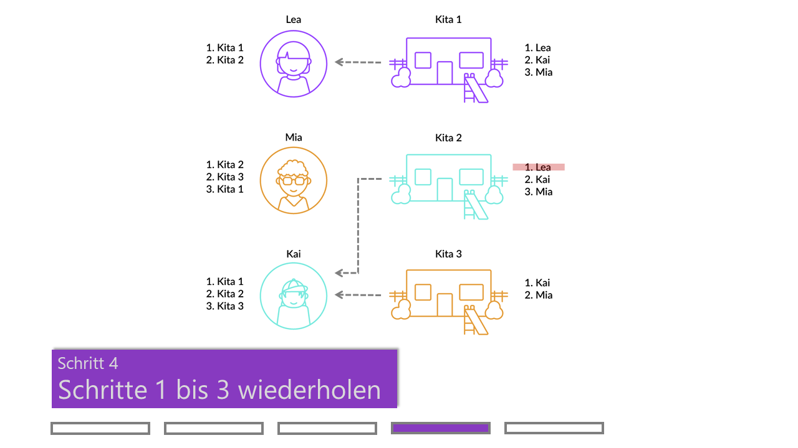
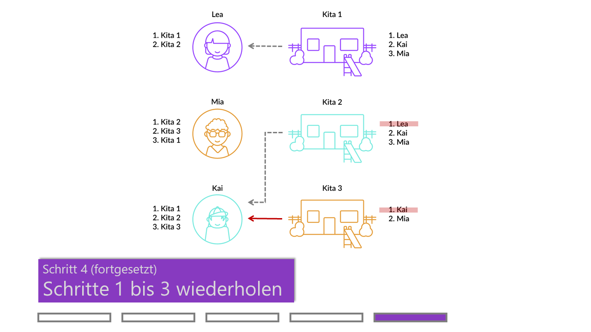

---

## Kitaplatzvergabe in 5 Schritten

<!--image slider start-->

  

    <!--radio buttons start-->
    <input type="radio" name="radio-btn" id="radio1">
    <input type="radio" name="radio-btn" id="radio2">
    <input type="radio" name="radio-btn" id="radio3">
    <input type="radio" name="radio-btn" id="radio4">
    <input type="radio" name="radio-btn" id="radio5">
    <!--radio buttons end-->
    <!--slide images start-->
    

      
    

    

      
    

    

      
    

    

      
    

    

      
    

    <!--slide images end-->
    <!--automatic navigation start-->
    

      

      

      

      

      

    

    <!--automatic navigation end-->
  

  <!--manual navigation start-->
  

    <label for="radio1" class="manual-btn"></label>
    <label for="radio2" class="manual-btn"></label>
    <label for="radio3" class="manual-btn"></label>
    <label for="radio4" class="manual-btn"></label>
    <label for="radio5" class="manual-btn"></label>
  

  <!--manual navigation end-->

<!--image slider end-->

---

## Vorteile im Überblick

    

        

            
        

        

            <b>SCHNELL</b> 
            Platzvergabe erfolgt in wenigen Stunden. Unnötige Wartezeiten werden eliminiert.
            

        

    

    

        

            
        

        

            <b>RESSOURCEN-SPAREND</b> 
            Effiziente und vereinfachte Prozesse sparen Kosten und Personalaufwand bei Kitas und Jugendamt.
            

        

    

    

        

            
        

        

            <b>FAIR</b> 
            Eltern werden strategische Abwegungen erspart. Damit entstehen keine unfairen Nachteile für schlechter informierte Eltern.
            

        

    

    

        

            
        

        

            <b>INDIVIDUALISIERBAR</b> 
            Jede Stadt ist anders. Unsere Lösungen passen sich Ihren Bedürfnissen an.
            

        

    

    

        

            
        

        

            <b>TRANSPARENT</b> 
            Bestehende Vergabekriterien werden respektiert. Es ist klar nachvollziehbar wer wo warum einen Platz bekommen hat - und wer nicht.
            

        

    

    

        

            
        

        

            <b>OPEN SOURCE</b> 
            Software-Lösung ist frei Nutzbar und Modifizierbar. Komplementär zu bestehenden Kita-Verwaltungsplattformen.
            

        

    

---

## Was zeichnet KitaMatch aus?

Entwickelt von einem Team...
 - mit über 10 Jahren Erfahrung mit Platzvergabeverfahren im Bildungsbereich
 - sehr gutem Verständnis für die Bedürfnisse von Eltern, Kitas und Jugendämtern
 - an der Spitze der Forschung im Bereich Marktdesign und Matching-Märkte
 - mit einer Vielzahl erfolgreicher Projekte

---

[PDF-Download](){: .btn .btn-purple }

---

## Gefördert durch

{:style="text-align:center;"}
[{:height="200px" width="200px"}]()
[{:height="200px" width="200px"}]()
[{:height="150px" width="150px"}]()

---

## Unsere Projekte

{:style="text-align:center;"}
[{:height="200px" width="200px"}]()
[{:height="150px" width="150px"}]()

---

## In der Presse

    

        
    

    

        <b>WirtschaftsWoche</b>
    

    

        <a href="Link-Ziel">Marktdesign: Ökonomie ohne Elfenbeinturm – der neue Kitaalgorithmus</a>
    

    

        
    

    

        <b>Frankfurter Allgemeine Zeitung</b>
    

    

        <a href="Link-Ziel">Gegen den Kita-Frust – wie ein Algorithmus Kitaplätze fairer vergeben soll</a>
    

    

        
    

    

        <b>Frankfurter Allgemeine Zeitung</b>
    

    

        <a href="Link-Ziel">Raus aus der Kita-Warteschlange</a>
    

---

## Aktuelles

**ZEW Expertise:** [Können Algorithmen eine bessere Kitaplatzvergabe ermöglichen?]()

Im Interview erklärt Marktdesignexperte Prof. Dr. Thilo Klein ein neues Verfahren, das von Ökonomen des ZEW, der Universität Münster und der University of Oxford pilotiert wird, und eine schnelle, faire und transparente Platzvergabe möglich macht. 

**ZEW Pressemitteilung:** [Kitaplätze schnell, fair und transparent mit einem dezentralen Mechanismus vergeben]()

Ein akuter Mangel an Betreuungsplätzen in Kindertagesstätten in Deutschland, komplizierte Anmeldeverfahren und intransparente Vergabekriterien: Das führt zu beruflicher Planungsunsicherheit für Eltern und deren Arbeitgebern, zu Benachteiligungen bildungsferner Haushalte und zu vermeidbarem Verwaltungsaufwand für Kita-Personal.

**ZEW Pressemitteilung:** [ZEW-Förderkreis vergibt erneut Wissenschaftspreise]()

Der ZEW-Förderkreis Wissenschaft und Praxis e.V. zeichnet auch 2020/21 herausragende wissenschaftliche Leistungen und wirtschaftspolitische Beratungsprojekte am ZEW aus. Mit dem Preis für das beste wirtschaftspolitische Beratungsprojekt wurde „KitaMatch“ ausgezeichnet. Das Projektteam entwickelte eine Open Source-Software, um die Kitaplatzvergabe in Deutschland neu zu gestalten.

**ZEW News:** [Wie Städte dem Ansturm auf Kindertagesstätten begegnen können]()

In vielen deutschen Städten ist die Vergabe von freien Plätzen in Kindertagesstätten intransparent und mit erheblichen Kosten für Eltern und Kita-Personal verbunden. Neben dem aktuellen Mangel an Kita-Plätzen führen auch ineffiziente Vergabeverfahren dazu, dass der Mangel größer erscheint, als er tatsächlich ist. Eine Möglichkeit zur flächendeckenden Lösung des Problems wären zentrale Vergabesysteme, die gutes Marktdesign durch den Einsatz von bewährten Algorithmen liefern kann.

